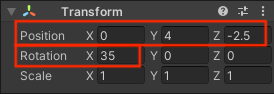
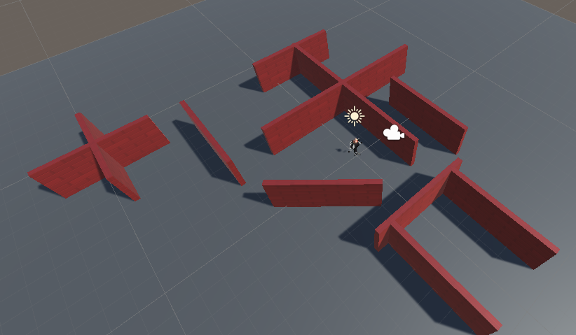
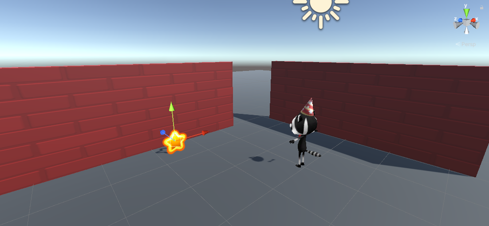

## نجم دوار

الأشياء القابلة للجمع في هذه اللعبة هي نجوم تدور لتجدب الإنتباه.

{:width="300px"}

--- task ---

ابدأ تشغيل Unity Hub وافتح المشروع الذي أنشأته لـ [Explore a 3D world](https://projects.raspberrypi.org/ar-SA/projects/explore-a-3d-world){:target=blank}.

--- collapse ---
---
title: لم أحصل على مشروع استكشاف عالم ثلاثي الأبعاد
---

إذا لم تكن قادرًا على فتح مشروع Explore a 3D world الخاص بك، فيمكنك تنزيل وفك ضغط واستيراد الحزمة [star collector starter package](https://rpf.io/p/ar-SA/star-collector-go){:target=blank}.

بعد استيراد الحُزْمَة، انتقل إلى مجلد الأصول وانقر نقرا مزدوجا على المشهد **عالم ثلاثي الأبعاد** لتحميله.

--- /collapse ---

[[[unity-importing-a-package]]]

--- /task ---

--- task ---

انقر بزر الفأرة الأيمن على مشهد **عالم ثلاثي الأبعاد** في نافذة التدرج الهرمي و **Save Scene As** `جStar Collector`.

يؤدي هذا إلى إنشاء ملف مشهد جديد في نافذة المشروع. يمكن للمشاهد في مشروع مشاركة الأصول بما في ذلك نصوص البرمجة.

يحتوي مشروعك الآن على مشهدين، لكنك ستعمل فقط على مشهد واحد في كل مرة.

--- /task ---

--- task ---

تحتاج اللعبة المصغرة لجامع النجوم إلى عرض كاميرا مرتفع بما يكفي لعرض تخطيط جزء من الخريطة ولكن ليس مرتفعا جدا لكي لا تكشف عن موقع النجوم.

في نافذة التدرج الهرمي، قم بالنقر على **Player** ثم حدد **اMain Camera**، وقم بتغيير الموقع والدوران في مكون التحويل الخاص بنافذة المفتش إلى:

--- /task ---

--- task ---

ستحتاج أيضا إلى إضافة بعض الجدران إلى مشهدك. انقر على الحائط واضغط على <kbd>Ctrl</kbd>+<kbd>D</kbd> لتكرار الجدار.

ضع الجدران الجديدة باستخدام أدوات التحويل والتدوير أو عن طريق تغيير القيم في مكون التحويل. كرر هذا عدة مرات، بحيث يكون لديك الكثير من الأماكن لإخفاء النجوم.

يمكنك التنقل حول مشهدك لرؤيته من زوايا مختلفة. إذا تهت، انقر فوق اللاعب في التدرج الهرمي ثم استخدم <kbd>Shift</kbd>+<kbd>F</kbd> للتركيز على اللاعب.

[[[unity-transform-tools]]]

[[[unity-scene-navigation]]]

--- /task ---

--- task ---

من نافذة المشروع ، انتقل إلى المجلد **Models** واسحب **Star** إلى **Scene view**.

--- /task ---

--- task ---

تأكد من تحديد Star GameObject في نافذة التدرج الهرمي وقم بوضعه باستخدام إما:
+ الأسهم من أداة التحويل وعرض المشهد
+ الإحداثيات من مكون التحويل في نافذة المفتش

يجب أن يكون نجمك بعيدًا عن الأرض؛ الموضع `y = 0.7` على وشك الصواب.

قد ترغب في إخفاء النجمة خلف الحائط بحيث يصعب على اللاعبين في لعبتك العثور على:

--- /task ---

--- task ---

في نافذة المفتش، انقر فوق **إضافة مكون** واختر **نص جديد**، ثم قم بتسمية البرنامج النصي الجديد `StarController`.

انقر نقرًا مزدوجًا فوق `StarController` في مكون البرنامج النصي لبدء تشغيل البرنامج النصي في المحرر.

--- /task ---

في [استكشاف عالم ثلاثي الأبعاد](https://projects.raspberrypi.org/ar-SA/projects/explore-a-3d-world/){:target="_blank"} `استخدمت تحويلين. تدوير` لقلب المشغل. يمكنك استخدام نفس الطريقة لتدوير النجمة حول المحور الشاقولي ع.

--- task ---

أسفل رمز الفئة العامة، أنشئ متغيرًا يسمى `spinSpeed` حتى تتمكن من التحكم في سرعة دوران نجمك:

--- code ---
---
language: cs
filename: StarController.cs
line_numbers: true
line_number_start: 5
line_highlights: 7
---
public class StarController : MonoBehaviour
{
    float spinSpeed = 0.5f;

--- /code ---

أضف رمزًا لتدوير نجمك:

--- code ---
---
language: cs
filename: StarController.cs - Update()
line_numbers: true
line_number_start: 16
line_highlights: 18
---
    void Update()
    {
        transform.Rotate(Vector3.up * spinSpeed); // استدارة حول المحور y (أعلى)
    }
--- /code ---

احفظ البرنامج النصي ثم عد إلى محرر الوحدة.

--- /task ---

--- task ---

**اختبار:** قم بتشغيل المشهد الخاص بك وتحقق من أن النجم يدور:

**التصحيح:** تأكد من إضافة البرنامج النصي إلى Star GameObject. إذا قمت بإضافته عن طريق الخطأ إلى كائن GameObject مختلف، فيمكنك النقر فوق النقاط الثلاث الموجودة بجوار مكون البرنامج النصي واختيار **إزالة المكون**.

**التصحيح:** قم بتغيير قيمة متغير `spinSpeed` إذا كنت تريد تسريع أو إبطاء السرعة التي يدور بها النجم.

--- /task ---

حان الوقت لنظام الجسيمات.

يستخدم تأثير الجسيمات **** الكثير من الصور الصغيرة أو "الجزيئات" لإنشاء تأثير مرئي يضفي الحياة على لعبة الكمبيوتر. في المرة القادمة التي تلعب فيها لعبة كمبيوتر، ابحث عن جميع الأماكن التي تستخدم فيها تأثيرات الجسيمات. 

--- task ---

انقر بزر الماوس الأيمن على **Star GameObject** في نافذة Hierarchy واختر **Effects** ثم **Particle System**. سيؤدي هذا إلى إضافة كائن اللعبه لنظام الجسيمات إلى النجم.

تعني إضافة نظام الجسيمات ككائن فرعي للنجمة أنه إذا قمت بتحريك النجم في عرض المشهد، فإن الجسيمات ستتحرك معه.

--- /task ---

--- task ---

**اختبار:** قم بتشغيل التعليمات البرمجية الخاص بك لرؤية أول دائرة زرقاء كبيرة. إنه يدور مع النجم وهو ليس مناسبًا تمامًا للنجم المتلألئ:

الخروج من وضع التشغيل.

--- /task ---

هناك الكثير من الإعدادات التي يمكنك استخدامها لتخصيص نظام الجسيمات.

--- task ---

انقر فوق **نظام الجسيمات** تحت النجم في التسلسل الهرمي. استخدم هذه الإعدادات لإنشاء تأثير لامع لا يدور مع النجمة:

**نصيحة:** لإغلاق منتقي الألوان ، انقر فوق "X" أو انقر في مكان آخر في Unity Editor.

--- /task ---

--- task ---

**اختبار:** انقر فوق الزر **Run** لتشغيل التعليمات البرمجية الخاصة بك.

اضبط الإعدادات حتى تصبح سعيدًا بتأثير الجسيمات.

تذكر أنه يمكنك تجربة الأشياء في وضع اللعب، لكنك تحتاج إلى الخروج من وضع اللعب لإجراء التغييرات التي تريد الاحتفاظ بها:

--- /task ---

الآن هذا النجم يطلب فقط أن يتم جمعه!

--- save ---
