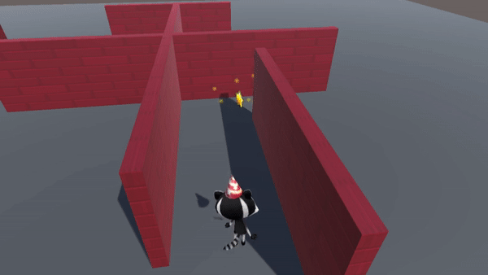
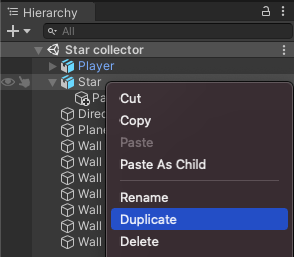

## جمع النجمة

يجب أن يختفي النجم عند جمعه. 

! [عرض المشهد بثلاث نجوم مخفي عن المشغل بالجدران.] (صور/ نجم مزدوج.png) {: عرض = "300بكسل"}

في Unity، يستدعي المصادم الذي يحتوي على **Trigger** طريقة `OnTriggerEnter` عند حدوث تصادم، ولكنه لا يمنع دخول اللاعب إلى المصادم.

--- task ---

حدد **نجم** وفي نافذة المفتش، انقر فوق **إضافة مكون**. ابدأ في كتابة `مربع` حتى ترى **مصادم الصندوق** وانقر فوقه. ستتم إضافة مكون جديد إلى النجم في نافذة المفتش.

انقر فوق الزر **صنع**.

انقر فوق <kbd>Shift</kbd>+<kbd>F</kbd> للتركيز على النجمة في طريقة عرض المشهد. سترى مخططًا للصندوق الأخضر حول النجمة: يُظهر هذا مخطط المصادم. إذا دخل مصادم اللاعب إلى هذه المنطقة، فسيحدث تصادم وسيتم استدعاء `OnTriggerEnter`:

--- /task ---

أنت تريد فقط أن يتم جمع النجمة إذا كان كائن اللعبه الذي اصطدم به هو اللاعب. تستخدم الوحدة **علامات** لتسمية كائنا للعبه. تتضمن الوحدة علامة لاعب.

--- task ---

حدد **لاعبك ** كائن اللعبة واضبط العلامة الخاصة به على `لاعب` باستخدام القائمة المنسدلة:

--- /task ---

--- task ---

افتح البرنامَج النصي المتحكم بالنجم الخاص بك عن طريق التبديل إلى محرر التعليمات البرمجية أو النقر نقرًا مزدوجًا فوق البرنامَج النصي في المجلد **نصي** من نافذة المشروع.

أضف طريقة `OnTriggerEnter` جديدة ضمن الإغلاق `}` من طريقة `تحديث` ولكن قبل الإغلاق `}` من فئة `متحكم النجم `:

--- code ---
---
language: cs filename: StarController.cs - OnTriggerEnter(Collider other) line_numbers: true line_number_start: 16
line_highlights: 20-27
---

    void Update()
    {
        transform.Rotate(Vector3.up * spinSpeed); // Rotate about the y (up) axis
    }
    void OnTriggerEnter(Collider other)
    {
        // Check the tag of the colliding object
        if (other.CompareTag("Player"))
        {
            gameObject.SetActive(false);
        }
    }
} --- /code ---

احفظ البرنامج النصي الخاص بك.

--- /task ---

--- task ---

**اختبار:** قم بتشغيل مشروعك. امش نحو النجم لرؤيته يختفي.

**تصحيح:** تحقق إضافة علامة لاعب إلى لاعبك GameObject وليس إلى النجم!

--- /task ---

إضافة مؤثرات صوتية تجعل جمع نجمة أكثر إرضاءً للاعب.

--- task ---

أضف متغيرًا عامًا من مجموعة `صوتًا` إلى البرنامَج النصي `متحكم النجم` لتخزين الصوت الذي تريد تشغيله:

--- code ---
---
language: cs filename: StarController.cs line_numbers: true line_number_start: 5
line_highlights: 8
---
فئة عامة المتحكم بالنجم : سلوك أحادي
{ سرعة دوران الطفو = 0.5f؛ مقطع صوتي عام يجمع الصوت ؛;

--- /code ---

يعني جعل المتغير `عامًا` أنه يمكنك تعيينه في المفتش والوصول إليه من كائنات كائن اللعبه الأخرى.

--- /task ---

--- task ---

أضف سطرًا إلى طريقة `OnTriggerEnter` لتشغيل الصوت في موقع النجمة. ستقوم طريقة `AudioSource.PlayClipAtPoint` بتشغيل الصوت:

--- code ---
---
اللغة: cs filename: StarController.cs - OnTriggerEnter (Collider other) line_numbers: true line_number_start: 21
line_highlights: 26
---

    void OnTriggerEnter(Collider other)
    {
        // Check the tag of the colliding object
        if (other.CompareTag("Player"))
        {
            AudioSource.PlayClipAtPoint(collectSound, transform.position);
            gameObject.SetActive(false);
        }
--- /code ---

احفظ الكود الخاص بك.

--- /task ---

--- task ---

عد إلى محرر الوحدة وانقر على **Star GameObject** في نافذة التسلل الهرمي.

ابحث عن خاصية **تجميع الصوت** لمكون البرنامج النصي StarController في نافذة المفتش.

انقر على الدائرة الموجودة على يمين خاصية جمع الصوت واختر **اجمع** صوت:

--- /task ---

--- task ---

**اختبار:** قم بتشغيل المشهد وجمع النجمة لسماع الصوت.

**Debug:** If you get an error that says `The variable collectSound of StarController has not been assigned.` this means you have not set the audio clip in the Inspector:
* Make sure the `collectSound` variable is `public`
* Find the `StarCollector` component in the Inspector of your Star, click the circle and select the `Collect` sound clip from the pop up window. --- /task ---

لعبتك تحتاج المزيد من النجوم.

--- task ---

حدد النجم في عرض المشهد وكرره باستخدام <kbd>Ctrl</kbd>+<kbd>D</kbd> (أو <kbd>Cmd</kbd>+<kbd>D</kbd>). نظام الجسيمات هو كائن فرعي، لذا سيتم تكرار هذا في نجمك الجديد:

سيظهر النجم الجديد في نفس الموضع، لذا اسحبه إلى موضع اختباء جديد في المشهد. سيتحرك نظام الجسيمات الكائن مع النجم.

لرؤية خريطتك في عرض من أعلى لأسفل، انقر بزر الماوس الأيمن حيث تظهر **Persp** في أعلى يمين عرض المشهد واختر **أعلى**. للعودة إلى العرض الطبيعي، انقر بزر الماوس الأيمن فوق **أعلى** واختر **مجانًا**:

يمكنك استخدام مفاتيح الأسهم للتحرك اليسار واليمين والتكبير. استمر في الضغط على زر الفأرة الأيمن واسحب للتحرك والتدوير.

كرر هذا حتى يكون لديك ثلاث نجوم مخفية على خريطتك:

--- /task ---

--- task ---

**Test:** Play your scene and collect all the stars. Make sure they all disappear and play a sound when collected.

--- /task ---

--- save ---
