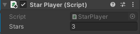
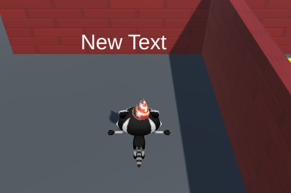

## عد النجوم

غالبًا ما تعرض الألعاب معلومات الحالة مثل النتيجة. سوف تُظهر عدد النجوم التي تم جمعها حتى الآن.

! [عرض اللعبة يُظهر متغير "النجوم" على اللوحة.](images/counting-stars.gif){:width="300px"}

يمكن أن يحتوي موضوع "كائن اللعبة" الخاص ببرنامج Unity على نصوص برمجة متعددة. ستضيف نصا برمجيا جديدا إلى اللاعب "Player" لتخزين وعرض عدد النجوم التي لديه.

يحتاج اللاعب إلى تتبع عدد النجوم التي جمعها، يمكنك ذلك باستخدام متغير.

--- task ---

حدد **Player** وفي Inspector ، انقر فوق **إضافة مكون** الفعل من (إنشاء) نص برمجي جديد يسمى `StarPlayer`. افتح البرنامَج النصي الجديد في محرر التعليمات البرمجية وأنشئ متغيرًا جديدًا يسمى `نجوم`:

--- code ---
---
language: cs
filename: StarPlayer.cs
line_numbers: true
line_number_start: 5
line_highlights: 7
---
public class StarPlayer : MonoBehaviour
{
    public int stars = 0; // العدد الصحيح هو رقَم صحيح
    // Start is called before the first frame update
    void Start()
    {
--- /code ---

احفظ النص البرمجي الخاص بك ثم عد إلى محرر Unity.

--- /task ---

يحتاج النص البرمجي `المتحكم بالنجم` إلى تحديث متغير `نجوم` على اللاعب "مشغل" في كل مرة يتم فيها جمع نجمة.

--- task ---

افتح النص البرمجي `المتحكم بالنجم` وأضف رمزا لزيادة عدد النجوم التي يمتلكها اللاعب بمقدار 1 في كل مرة يتم فيها جمع نجمة.

يتم تعيين المعلمة `الأخرى` للطريقة `OnTriggerEnter` على كائن GameObject الذي اصطدم بالنجمة. يمكنك استخدامه للوصول إلى المتغير `النجوم` من `مشغل النجم`:

--- code ---
---
language: cs
filename: StarController.cs - OnTriggerEnter(Collider other)
line_numbers: true
line_number_start: 21
line_highlights: 26, 27
---
    void OnTriggerEnter(Collider other)
    {
        // تحقق من علامة الجسم المتصادم
        if (other.CompareTag("Player"))
        {
            StarPlayer player = other.gameObject.GetComponent<StarPlayer>();
            player.stars += 1; // زيادة بمقدار 1
            AudioSource.PlayClipAtPoint(collectSound, transform.position);
            gameObject.SetActive(false);
        }
    }
--- /code ---

احفظ نصك البرمجي ثم عد إلى محرر Unity.

--- /task ---

--- task ---

**إختبار:** شغل المشهد الخاص بك وإجمع النجوم الثلاثة. شاهد المتغير العام `نجوم` في نافذة مراقب اللاعب للتحقق من أن الرَّقْم يزيد بمقدار 1 في كل مرة تجمع فيها نجمة:

**Debug:** إذا كنت لا تر المتغير `Stars` في المفتش "Inspector"، فتحقق حفظ النص البرمجي `StarPlayer.cs`.

--- /task ---

تعد القدرة على رؤية عدد النجوم التي تم جمعها أمرا رائعا للاختبار الخاص بك ولكن المستخدمين لن يتمكنوا من رؤية ذلك.

**UI** أو عناصر واجهة المستخدم تسمح لمشروع Unity باستخدام الكائنات بما في ذلك النص، الأزرار أو أشرطة التمرير للتواصل والتفاعل مع المستخدم أو الاعب. غالبا ما تستخدم عناصر واجهة المستخدم في شاشات بدء اللعبة و الإعدادات ولإعطاء معلومات للمستخدم والسماح له بإجراء الخيارات. 

--- task ---

انقر بزر المواس الأيمن في نافذة التسلسل الهرمي وانتقل إلى **UI** ثم حدد **Text - TextMeshPro**. يؤدي هذا إلى إنشاء لوحة بها كائن نصي فرعي؛ يمكنك رؤية النص في **عرض اللعبة**:

--- collapse ---

---
title: إستخدام رسالة TextMeshPro لأول مرة
---

يمكنك رؤية نافذة منبثقة تطلب منك استيراد أساسيات TextMeshPro، أمثلته وإضافاته لمشروعك. في هذه الحالة ، أنقر على الزرين **استيراد** بالتناوب، ثم أغلق النافذة:

--- /collapse ---

--- /task ---

--- task ---

انقر بزر الماوس الأيمن على **Text (TMP) GameObject** الجديد وحدد `إعادة تسمية`. أطلق عليه اسم `Stars Text` للتعرف عليه بسهولة:

--- /task ---

--- task ---

في نافذة Inspector ، لكائن TextMeshPro GameObject ، انتقل إلى مكون**Text Input** component. تغيير `New Text` إلى `Stars: 0`:

--- /task ---

--- task ---

في المكون **تحويل مستقيم**، انقر فوق المحاذاة وقم بتغييرها إلى **أعلى اليسار**. ثم غير الموقع إلى `x = 120`, `y = -50`.

سيؤدي ذلك إلى وضع مركز النص على بعد 120 بكسل من اليسار و-50 بكسل من الأعلى. سيبقى النص في موضعه إذا قمت بتغيير حجم عرض اللعبة:

**نصيحة:** يمكنك عرض موضع النص في عرض اللعبة حتى عندما لا تكون في وضع التشغيل.

--- /task ---

أنت الآن بحاجة إلى تحديث النص المعروض بحيث يعرض العدد الحالي للنجوم التي جمعها اللاعب.

--- task ---

افتح النص البرمجي `StarPlayer` وأضف `باستخدام TMPro` في الجزء العلوي حتى يتمكن نصك البرمجي من استخدام `TMP_Text`:

--- code ---
---
language: cs
filename: StarPlayer.cs
line_numbers: true
line_number_start: 1
line_highlights: 4
---
using System.Collections;
using System.Collections.Generic;
using UnityEngine;
using TMPro;
--- /code ---

--- /task ---

--- task ---

أضف تعليمات برمجية لإنشاء كائن TMP_Text يدعى `starText`:

--- code ---
---
language: python
filename: StarPlayer.cs
line_numbers: true
line_number_start: 6
line_highlights: 9
---
public class StarPlayer : MonoBehaviour
{
    public int stars = 0; // العدد الصحيح هو رقَم صحيح
    public TMP_Text starText;
    // Start is called before the first frame update
--- /code ---

--- /task ---

--- task ---

استخدم الأسلوب `SetText` من الفئة `TMP_Text` لعرض عدد النجوم التي تم جمعها في كل تحديث:

--- code ---
---
language: python
filename: StarPlayer.cs - Update()
line_numbers: true
line_number_start: 16
line_highlights: 21
---
public class StarPlayer : MonoBehaviour
{
    // Update is called once per frame
    void Update()
    {
        starText.SetText("Stars: " + stars);
    }
--- /code ---

احفظ تعليماتك البرمجية ثم قم بالعودة إلى محرر Unity.

--- /task ---

--- task ---

في نافذة Player's Inspector للبرنامج النصي `StarPlayer`، انقر فوق الدائرة المجاورة لخاصية Star Text واختر **Star Text** لربط كائن النص.

--- /task ---

--- task ---

شغل المشهد الخاص بك والتحقق من أن العدد في نص واجهة المستخدم يزداد كل مرة تجمع فيها نجمة:

--- /task ---

--- save ---

