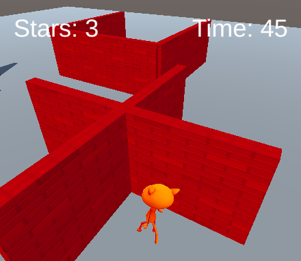

## Introduction

Make a minigame where you collect sparkling stars as fast as you can.

This project follows on from [Explore a 3D World](https://projects.raspberrypi.org/en/projects/explore-a-3d-world). You can use the Unity scene that you created in that project as the basis for this project. We've also provided a starter project that you can use.

A **minigame** is a short computer game. Larger computer games often contain multiple minigames. Do you play any games that contain minigames?

You will:
+ Use colliders and triggers to control what happens when GameObjects collide.
+ Add sound and particle effects.
+ Create, set, and display score and time variables.

--- no-print ---
--- task ---
### Try it

  
Try and collect the stars as fast as you can. How close do you have to be to a star to collect it? What happens to the time when you have collected all of the stars? What graphic effects does the star have?

  <iframe allowtransparency="true" width="485" height="402" src="https://scratch.mit.edu/projects/embed/485673032/?autostart=false" frameborder="0"></iframe>

--- /task ---
--- /no-print ---

--- print-only ---

--- /print-only ---
