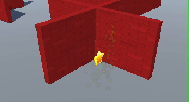
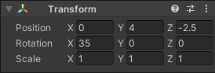
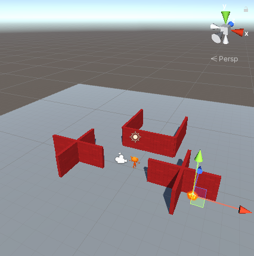
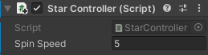
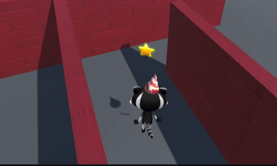
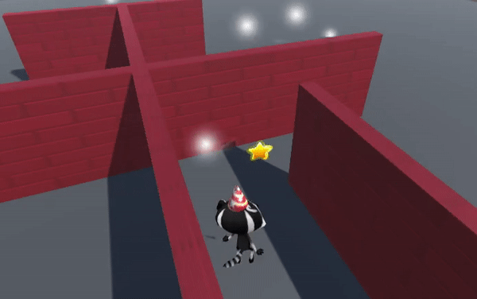
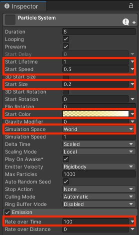
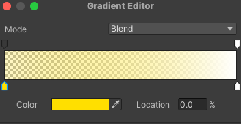

## A spinning star

<div style="display: flex; flex-wrap: wrap">
<div style="flex-basis: 200px; flex-grow: 1; margin-right: 15px;">
The collectibles in this game are stars that spin to attract attention.
</div>
<div>
{:width="300px"}
</div>
</div>

--- task ---

Launch the Unity hub and open the project you created for [Explore a 3D world](https://projects.raspberrypi.org/en/projects/explore-a-3d-world){:target=blank}. 

--- collapse ---

---
title: I haven't got my Explore a 3D world project
---

If you are not able to open your project you can download, unzip and open this  [Star collector](){:target=blank}. 

--- /collapse ---

--- /task ---

--- task ---

Right click on the '3D world' scene in the Hierarchy and 'Save Scene As' `Star collector`. 

This creates a new Scene file in the Projects Window. Scenes in a project can share Assets including Scripts. 

Your project now contains two scenes but you will only work on one scene at a time. 

--- /task ---

--- task ---

The star collector minigame needs a camera view that is high enough to view the layout of some of the map but not too high or it will reveal the position of the stars.  

In the Hierarchy window, click on `Player` then select `Main Camera` change the position in the Inspector window Transform component to:



--- /task ---

--- task ---

In the Project window go to the 'Models' folder and drag the `Star` into the scene view. 

--- /task ---

--- task ---

Make sure the Star game object is selected in the Hierarchy window and position it using either:
+ the arrows from the Transform tool and the Scene view
+ the coordinates from the Transform component in the Inspector

Your star should be off the ground, Position Y=0.7 is about right. 

You might want to hide the star behind a wall so it's harder for players of your game to find. 



--- /task ---

--- task ---

**Test:** Run your project and move the player to your star in Game view. Walk right into the Star. Notice that you can walk right through it! 

Change the coordinates of the star until you are happy with the position.

**Tip:** If you change the coordinates whilst in playmode you will need to remember the position you like best and update them again after you stop the scene running. 

--- /task ---

--- task ---
In the Project Window, navigate to 'Assets' right-click and choose 'Create' then 'Folder'. Name your folder `My Scripts`. 

Right-click on `My Scripts` and choose 'Create' then 'C# Script' and name your new script `StarController`.
--- /task ---

--- task ---
Add code to spin your Star. Create a variable called `speed` so you can control how fast your star spins:

```
public float spinSpeed = 5.0f; // the f says the number is a decimal (float)

// Update is called once per frame
void Update()
{
    transform.Rotate(Vector3.up * spinSpeed);
}

```

Save your script then return to the Unity editor. 

--- /task ---

--- task ---

Select the Star GameObject and drag the StarController Script to the Inspector. 

The Script will appear as a new component in the Inspector.



--- /task ---

--- task ---

**Test:** Play your scene and check that the Star is spinning. 



**Debug:** Make sure you added the Script to the Star GameObject. If you accidentally added it to a different GameObject then you can use 'Ctrl-Z' to undo, or click the three dots next to the Script component and choose 'Remove Component.'

--- /task ---

Time for a particle effect. 

<p style="border-left: solid; border-width:10px; border-color: #0faeb0; background-color: aliceblue; padding: 10px;">
A <span style="color: #0faeb0">**particle effect**</span> uses lots of small images, or 'particles', to create a visual effect which adds life to a computer game. Next time you play a computer game, look out for all the places where particle effects are used. 
</p>

--- task ---
Right-click on the Star object in the Hierarchy and choose 'Create' then 'Effects' then 'Particle System'. This will add a ParticleSystem GameObject to the Star. 

--- /task ---

--- task ---

--- /task ---

--- task ---
**Test:** Play your Scene to see the default particle effect. It's spinning with the Star and it's not quite right for a sparkling star.



--- /task ---

--- task ---

Exit Playmode.

To stop the particles spinning with the Star, change the 'Simulation Space' in the Inspector to 'World'. The particles will now move freely in the world. 

--- /task ---

There are lots of settings that you can use to customise the Particle System. 

--- task ---

Use these settings to create a star effect. 

Click on the arrow next to 'Start color' and select `gradient` then click on the colour box to choose a yellow starting point. 






--- /task ---

--- task ---
**Test:** Click Play to see the effect. 

Adjust settings until you are happy with the particle effect. 

Remember, you can try things out in Playmode, but you need to exit Playmode to make changes that you want to keep.


--- /task ---

Now that Star is just asking to be collected. 

--- save ---