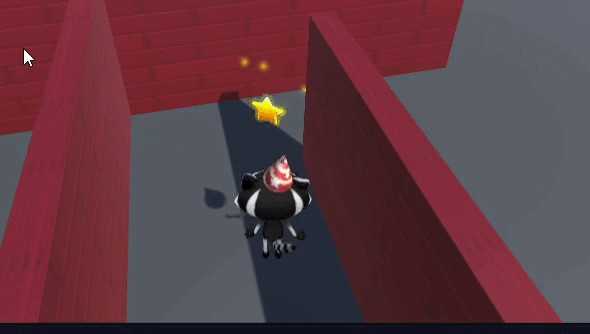

## A spinning star

The collectibles in this game are stars that spin to attract attention.

{:width="300px"}

--- task ---

Launch the Unity Hub and open the project you created for [Explore a 3D world](https://projects.raspberrypi.org/en/projects/explore-a-3d-world){:target=blank}. 

--- collapse ---
---
title: I haven't got my Explore a 3D world project
---

If you are not able to open your Explore a 3D world project, you can download, unzip, and import this [Star collector starter package](https://rpf.io/p/en/star-collector-go){:target=blank}.

After the package has been imported, go to the Assets folder and double-click on the **3D World** scene to load it. 

--- /collapse ---

[[[unity-importing-a-package]]]

--- /task ---

--- task ---

Right-click on the **3D World** scene in the Hierarchy window and **Save Scene As** `Star Collector`. 

This creates a new Scene file in the Project window. Scenes in a project can share Assets including Scripts. 

Your project now contains two scenes, but you will only work on one scene at a time. 

--- /task ---

--- task ---

The star collector minigame needs a camera view that is high enough to view the layout of some of the map but not too high or it will reveal the position of the stars.  

In the Hierarchy window, click on **Player** then select **Main Camera**, and change the Position and Rotation in the Inspector window's Transform component to:

--- /task ---

--- task ---

You're also going to need to add a few more walls to your scene. Click on a wall and press <kbd>Ctrl</kbd>+<kbd>D</kbd> to duplicate the wall.

Position the new walls using the transform and rotate tools or by changing the values in the Transform component. Repeat this several times, so that you have plenty of places to hide stars.

You can navigate around your scene to see it from different angles. If you get lost, click on your Player in the Hierarchy and then use <kbd>Shift</kbd>+<kbd>F</kbd> to focus on the Player. 

[[[unity-transform-tools]]]

[[[unity-scene-navigation]]]

--- /task ---

--- task ---

In the Project window, go to the **Models** folder and drag the **Star** into the **Scene view**. 

--- /task ---

--- task ---

Make sure the Star GameObject is selected in the Hierarchy window and position it using either:
+ The arrows from the Transform tool and the Scene view
+ The coordinates from the Transform component in the Inspector window

Your star should be off the ground; position `y = 0.7` is about right. 

You might want to hide the star behind a wall so it's harder for players of your game to find: 

--- /task ---

--- task ---

In the Inspector window, click **Add Component** and choose **New script**, then name your new script `StarController`.

--- /task ---

--- task ---

Double-click on `StarController` in the script component to launch your script in the editor. 

--- /task ---

In [Explore a 3D world](https://projects.raspberrypi.org/en/projects/explore-a-3d-world/){:target="_blank"} you used `transform.Rotate` to turn the Player. You can use the same method to spin the Star around the y-axis.

--- task ---

Underneath the public class code, create a variable called `spinSpeed` so you can control how fast your star spins:

--- code ---
---
language: cs
filename: StarController.cs
line_numbers: true
line_number_start: 5
line_highlights: 7
---
public class StarController : MonoBehaviour
{
    float spinSpeed = 0.5f;

--- /code ---

Add code to spin your star:

--- code ---
---
language: cs
filename: StarController.cs - Update()
line_numbers: true
line_number_start: 16
line_highlights: 18
---
    void Update()
    {
        transform.Rotate(Vector3.up * spinSpeed); // Rotate about the y (up) axis
    }
--- /code ---

Save your script then return to the Unity Editor. 

--- /task ---

--- task ---

**Test:** Play your scene and check that the star is spinning: 

**Debug:** Make sure you added the Script to the Star GameObject. If you accidentally added it to a different GameObject, then you can click the three dots next to the Script component and choose **Remove Component**.

**Debug:** Change the value of your `spinSpeed` variable if you want to speed up or slow down the speed at which the star spins.

--- /task ---

Time for a particle system. 

A **particle effect** uses lots of small images, or 'particles', to create a visual effect that adds life to a computer game. Next time you play a computer game, look out for all the places where particle effects are used. 

--- task ---

Right-click on the **Star GameObject** in the Hierarchy window and choose **Effects** then **Particle System**. This will add a Particle System GameObject to the Star. 

Adding the Particle System as a child object of the Star means that if you move the star in Scene view, the particles will move with it. 

--- /task ---

--- task ---

**Test:** Play your scene to see the default particle effect. It's spinning with the star and it's not quite right for a sparkling star:

Exit Play mode.

--- /task ---

There are lots of settings that you can use to customise the Particle System. 

--- task ---

Click on **Particle System** beneath the Star in the Hierarchy. Use these settings to create a sparkle effect that doesn't spin with the Star: 

**Tip:** To close the colour picker, click on the 'X' or click elsewhere in the Unity Editor. 

--- /task ---

--- task ---

**Test:** Click **Play** to see the effect. 

Adjust the settings until you are happy with the particle effect. 

**Remember**, you can try things out in Play mode, but you need to exit Play mode (click the ▶️ icon at the top) to make changes that you want to keep:

--- /task ---

Now that star is just asking to be collected! 

--- save ---
