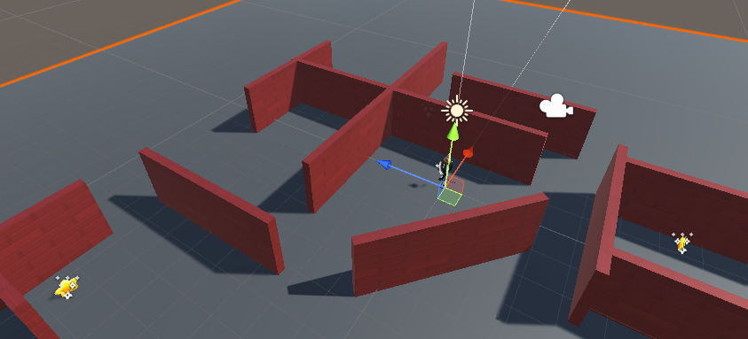
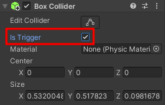
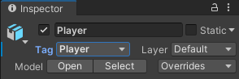
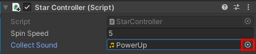
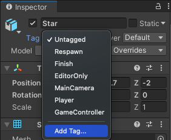
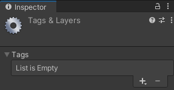
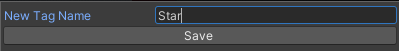
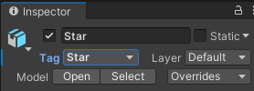
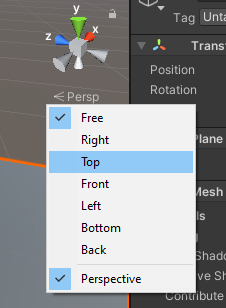
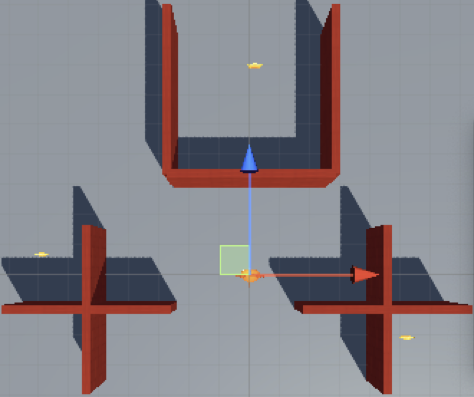

## Collecting the star

<div style="display: flex; flex-wrap: wrap">
<div style="flex-basis: 200px; flex-grow: 1; margin-right: 15px;">
The Star needs to disappear when you collect it. 
</div>
<div>
{:width="300px"}
</div>
</div>

In Unity a Collider with a **Trigger** calls the `OnTriggerEnter` Method when a collision happens but it does not prevent a Player walking into the collider. 

--- task ---

Select the Star and in the Inspector, click Add Component. Start typing 'box' until you see 'Box Collider' and click it. A new component will be added to the Star in the Inspector.

Check the **is Trigger** box.



Click 'Shift-F' to focus on the Star in the Scene view. You will see a green box outline around the Star this shows the outline of the collider. If the Player's collider enters this area then there will be a collision and `OnTriggerEnter` will be called. 


--- /task ---

You only want the Star to be collected if the object that has collided with it is the Player. Unity uses **Tags** to label GameObjects. Unity includes a 'Player' tag.


--- task ---

Select your **Player** GameObject and sets its 'Tag' to 'Player' using the drop-down menu.



--- /task ---

--- task ---

Open your 'StarController' Script by switching to your code editor or double-clicking on the Script in your `My Scripts` folder from the Projects Window.

Add a new `OnTriggerEnter` Method under the closing `}` of the `Update` method but before the closing `}` of the `StarController` class.

```
        transform.Rotate(Vector3.up * spinSpeed);
    }
    
    void OnTriggerEnter(Collider other)
    {
        // Check the tag of the colliding object 
        if(other.gameObject.tag == "Player")
        {
            Destroy(gameObject);
        }
    }
}
```
--- /task ---

--- task ---

**Test:** Save your Script and Play your project. Walk into the Star to see it disappear. 

**Debug:** Make sure you have added the 'Player' tag to your Player GameObject and not to the Star!


--- /task ---

Adding a sound effect makes collecting a star more satisfying for the player. 

--- task ---

Add a `collectSound` variable to your `StarController` script to store the sound that you want to play.

```
public class StarController : MonoBehaviour
{
    public float spinSpeed = 5.0f; // the f says the number is a decimal (float)
    public AudioClip collectSound;
```

--- /task ---

--- task ---
Add a line to the `OnTriggerEnter` Method to play the sound at the location of the Star. The 'AudioSource.PlayClipAtPoint` Method will play the sound 

```
void OnTriggerEnter(Collider other)
    {
        // Check the tag of the colliding object 
        if(other.gameObject.tag == "Player")
        {
            AudioSource.PlayClipAtPoint(collectSound, transform.position);
            Destroy(gameObject);
        }
    }
```

Save your code.
--- /task ---

--- task ---

Switch back to the Unity editor and find the 'Collect Sound' property of the 'StarController' script in the Inspector for the Star. 

Click on the circle to the right of the 'Collect Sound' property and choose the 'PowerUp' sound.



--- /task ---

--- task ---

**Test:** Play your Scene and collect the Star to hear the sound.

--- /task ---

Your game needs more Stars.

--- task ---

From the Inspector window, add a new tag called `Star` and tag your Star GameObject.







Click on the `Star` in the Hierarchy window then use the dropdown for the `Tag` in the Inspector window to select your new `Star` tag. 



--- /task ---

--- task ---

Right-click on your Star in the Hierarchy and choose 'Duplicate' to create a new Star. The Particle System is a child object so this will be duplicated in your new star.


The new Star will appear in the same position, drag it to a new hiding position in the Scene. The child Particle System will move with the Star.

To see your map in a top-down view Right click where it says 'Persp' in the top right of the Scene view and choose 'Top'. To return to the normal view, right-click on Top and choose 'Free'.



You can use the arrow keys to move left and right and zoom. Hold the right mouse button down and drag to move and rotate. 

Repeat this so you have three Stars hidden on your map. 



--- /task ---

--- save ---