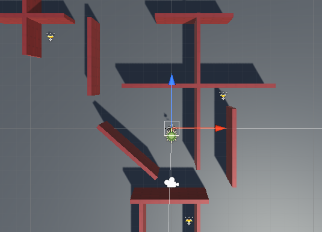

## Collecting the star

The star needs to disappear when you collect it. 

{:width="300px"}

In Unity, a Collider with a **Trigger** calls the `OnTriggerEnter` method when a collision happens, but it does not prevent a Player walking into the Collider. 

--- task ---

Select the **Star** and in the Inspector window, click **Add Component**. Start typing `box` until you see **Box Collider** and click it. A new component will be added to the Star in the Inspector window.

Check the **Is Trigger** box.

Click <kbd>Shift</kbd>+<kbd>F</kbd> to focus on the Star in the Scene view. You will see a green box outline around the Star: this shows the outline of the Collider. If the Player's Collider enters this area, then there will be a collision and `OnTriggerEnter` will be called: 

--- /task ---

You only want the star to be collected if the GameObject that has collided with it is the Player. Unity uses **Tags** to label GameObjects. Unity includes a Player tag.

--- task ---

Select your **Player** GameObject and set its Tag to `Player` using the drop-down menu:

--- /task ---

--- task ---

Open your StarController script by switching to your code editor or double-clicking on the script in your **My Scripts** folder from the Project window.

Add a new `OnTriggerEnter` method under the closing `}` of the `Update` method but before the closing `}` of the `StarController` class:

--- code ---
---
language: cs
filename: StarController.cs - OnTriggerEnter(Collider other)
line_numbers: true
line_number_start: 16
line_highlights: 20-27
---
    
    void Update()
    {
        transform.Rotate(Vector3.up * spinSpeed); // Rotate about the y (up) axis
    }
    void OnTriggerEnter(Collider other)
    {
        // Check the tag of the colliding object
        if (other.CompareTag("Player"))
        {
            gameObject.SetActive(false);
        }
    }
    
--- /code ---

Save your script.

--- /task ---

--- task ---

**Test:** Play your project. Walk into the star to see it disappear. 

**Debug:** Make sure you have added the Player tag to your Player GameObject and not to the Star!

--- /task ---

Adding a sound effect makes collecting a star more satisfying for the player. 

--- task ---

Add a public `collectSound` variable to your `StarController` script to store the sound that you want to play:

--- code ---
---
language: cs
filename: StarController.cs
line_numbers: true
line_number_start: 5
line_highlights: 8
---
public class StarController : MonoBehaviour
{
    float spinSpeed = 0.5f;
    public AudioClip collectSound;
    
--- /code ---

Making a variable `public` means you can assign it in the Inspector and access it from other GameObjects.

--- /task ---

--- task ---

Add a line to the `OnTriggerEnter` method to play the sound at the location of the star. The `AudioSource.PlayClipAtPoint` method will play the sound: 

--- code ---
---
language: cs
filename: StarController.cs - OnTriggerEnter(Collider other)
line_numbers: true
line_number_start: 21
line_highlights: 26
---
    void OnTriggerEnter(Collider other)
    {
        // Check the tag of the colliding object
        if (other.CompareTag("Player"))
        {
            AudioSource.PlayClipAtPoint(collectSound, transform.position);
            gameObject.SetActive(false);
        }
--- /code ---

Save your code.

--- /task ---

--- task ---

Switch back to the Unity Editor and click on the **Star GameObject** in the Hierarchy window. 

Find the **Collect Sound** property of the Star's StarController script component in the Inspector window. 

Click on the circle to the right of the Collect Sound property and choose the **Collect** sound:

--- /task ---

--- task ---

**Test:** Play your scene and collect the star to hear the sound.

--- /task ---

Your game needs more stars.

--- task ---

Select your Star in the Scene view and duplicate it with <kbd>Ctrl</kbd>+<kbd>D</kbd> (or <kbd>Cmd</kbd>+<kbd>D</kbd>). The Particle System is a child object so this will be duplicated in your new star:

The new star will appear in the same position, so drag it to a new hiding position in the scene. The child Particle System will move with the star.

To see your map in a top-down view, right-click where it says **Persp** in the top right of the Scene view and choose **Top**. To return to the normal view, right-click on **Top** and choose **Free**:

You can use the arrow keys to move left and right and zoom. Hold the right mouse button down and drag to move and rotate. 

Repeat this so you have three stars hidden on your map: 

--- /task ---

--- task ---

**Test:** Play your scene and collect all the stars. Make sure they all disappear and play a sound when collected.

--- /task ---

--- save ---
