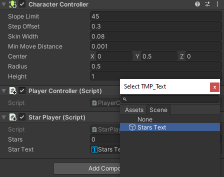

## Counting stars

Games often show status information such as a score. You will show the number of Stars collected so far.

{:width="300px"}

A Unity GameObject can have multiple scripts. You will add a new script to the Player to store and display the numbers of stars they have. 

The Player needs to keep track of how many stars they have collected, you can do this with a variable. 

--- task ---

Select the **Player** and in the Inspector click 'Add Component' and create a new script called `StarPlayer`. Open your new script in the code editor and create a new variable called `stars`:

--- code ---
---
language: cs
filename: StarPlayer.cs
line_numbers: true
line_number_start: 5
line_highlights: 7
---
public class StarPlayer : MonoBehaviour
{
    public int stars = 0; // an integer whole number
    // Start is called before the first frame update
    void Start()
    {
--- /code ---

Save your script and return to the Unity editor.

--- /task ---

The 'StarController' script needs to update the `stars` variable on the Player each time a Star is collected.

--- task ---

Open your `StarController` script and add code to increase the number of stars the player has by 1 every time a star is collected. 

The `other` parameter of the `OnTriggerEnter` method is set to the GameObject that has collided with the Star. You can use it to access the `stars` variable from `StarPlayer`: 

--- code ---
---
language: cs
filename: StarController.cs
line_numbers: true
line_number_start: 21
line_highlights: 26, 27
---
    void OnTriggerEnter(Collider other)
    {
        // Check the tag of the colliding object
        if (other.gameObject.tag == "Player")
        {
            StarPlayer player = other.gameObject.GetComponent<StarPlayer>();
            player.stars += 1; // increase by 1
            AudioSource.PlayClipAtPoint(collectSound, transform.position);
            Destroy(gameObject);
        }
    }
--- /code ---

Save your script and return to the Unity editor.

--- /task ---

--- task ---

**Test:** Run your scene and collect the three stars. Watch the public `stars` variable in the Player's Inspector window to check that the number increases by 1 every time you collect a star: 

**Debug** If you don't see the `Stars` variable in the Inspector, make sure you have saved your `StarPlayer.cs` script.

--- /task ---

Being able to see how many stars have been collected is great for your testing but users will not be able to see that. 

A **UI** or User Interface elements allow a Unity project to use objects including text, buttons, sliders to communicate and interact with the user or player. UI elements are often used for game start screens and settings and for giving information to the user and allowing the user to make choices. 

--- task ---

Right-click in the Hierarchy window and go to 'UI' then select 'Text - TextMeshPro'. This creates a canvas with child text object, you can see the text in the Game view:

--- collapse ---

---
title: First time using TextMeshPro message
---

You might see a popup window asking you to import TextMeshPro essentials, examples and extras to your project. If this is the case, click on the two Import buttons in turn then close the window:

--- /collapse ---

--- /task ---

--- task ---

Right-click on the new Text - (TMP) GameObject and select `rename`. Call it `Stars Text` to easily identify it:

--- /task ---

--- task ---

In the Inspector window, for the TextMeshPro GameObject, go to the 'Text Input' component. Change `New Text` to `Stars: 0`:

--- /task ---

--- task ---

In the 'Rect Transform' component, click and change the alignment to 'Top Left'. And change the Position to X = `120`, y = `-50`.

This will position the centre of your text 120 pixels from the left and -50 pixels from the top. The text will stay in position if you resize the Game view:

**Tip:** You can view the position of the text in the Game view even when you are not in Playmode.

--- /task ---

Now we need to update the text that is displayed so that it shows the current number of stars collected by the player.

--- task ---

Open your `StarPlayer` script and add `using TMPro` at the top so that your script can use `TMP_Text`:

--- code ---
---
language: cs
filename: StarPlayer.cs
line_numbers: true
line_number_start: 1
line_highlights: 4
---
using System.Collections;
using System.Collections.Generic;
using UnityEngine;
using TMPro;
--- /code ---

--- /task ---

--- task ---

Add code to create a TMP_Text Object called `starText`: 

--- code ---
---
language: python
filename: StarPlayer.cs
line_numbers: true
line_number_start: 6
line_highlights: 9
---
public class StarPlayer : MonoBehaviour
{
    public int stars = 0; // an integer whole number
    public TMP_Text starText;
    // Start is called before the first frame update
--- /code ---

--- /task ---

--- task ---

Use the `SetText` method from the `TMP_Text` class to display the number of stars collected on each update:

--- code ---
---
language: python
filename: StarPlayer.cs
line_numbers: true
line_number_start: 16
line_highlights: 19
---
public class StarPlayer : MonoBehaviour
{
    // Update is called once per frame
    void Update()
    {
        starText.SetText("Stars: " + stars);
    }
--- /code ---

Save your code and switch back to the Unity editor. 

--- /task ---

--- task ---

In the Player's Inspector window for the 'StarPlayer' script, click on the circle next to the 'Star Text' property and choose `Stars Text` to link your text object. 

--- /task ---

--- task ---

Play your scene and check that the number in the UI text increases each time you collect a star: 

--- /task ---

--- save ---

