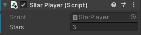

## Counting stars

<div style="display: flex; flex-wrap: wrap">
<div style="flex-basis: 200px; flex-grow: 1; margin-right: 15px;">
Games often show status information such as a score. You will show the number of Stars collected so far.
</div>
<div>
{:width="300px"}
</div>
</div>

A Unity GameObject can have multiple scripts. We'll add a new script to the Player to store and display the numbers of stars they have. 

The Player needs to keep track of how many stars they have collected, you can do this with a variable. 

--- task ---

In the Project window, right-click on the 'My Scripts' folder and create a new script called `StarPlayer`. Open your new script in the code editor and create a new variable called `stars`.

```
    public int stars = 0; // an integer whole number

    // Update is called once per frame
    void Update()
    {
        
    }
```

Save your script and return to the Unity editor.

--- /task ---

--- task ---
Drag your new 'StarPlayer' script to the **Player** GameObject. 

The Player will keep track of the overall number of stars they have collected.

--- /task ---

The `StarCollector` script will update the `stars` variable on the Player each time a Star is collected.

--- task ---

Open your `StarController` script and add code to increase the number of stars the player has by 1 every time a star is collected. 

The `other` parameter of the `OnTriggerEnter` method is set to the GameObject that has collided with the Star. You can use it to access the `stars` variable from `StarPlayer`. 

```
    void OnTriggerEnter(Collider other)
    {
        if(other.gameObject.tag == "Player")
        {
            Destroy(gameObject);
            StarPlayer player = other.gameObject.GetComponent<StarPlayer>();
            player.stars += 1; // increase by 1
            AudioSource.PlayClipAtPoint(collectSound, transform.position, 1f);
        }
    }
```

Save your script and return to the Unity editor.

--- /task ---

--- task ---

**Test:** Run your scene and collect the three stars. Watch the public `stars` variable in the Player's Inspector window to check that the number increases by 1 every time you collect a star. 



--- /task ---

Being able to see how many stars have been collected is great for your testing but users will not be able to see that. 

<p style="border-left: solid; border-width:10px; border-color: #0faeb0; background-color: aliceblue; padding: 10px;">
A <span style="color: #0faeb0">**UI**</span> or User Interface elements allow a Unity project to use objects including text, buttons, sliders to communicate and interact with the user or player. UI elements are often used for game start screens and settings and for giving information to the user and allowing the user to make choices. 
</p>

--- task ---

Right-click in the Hierarchy and go to UI > Text - TextMeshPro. This creates a canvas with child text object, you can see the text in the Game view.


<mark>Add a collapse using Text incase they can't use TMP? </mark>

--- collapse ---

---
title: First time using TextMeshPro message
---

You might see a popup window asking you to import TextMeshPro essentials, examples and extras to your project. If this is the case, click on the two Import buttons in turn then close the window.


--- /collapse ---

--- /task ---

--- task ---

In the Inspector, in the Text Input for the TextMeshPro GameObject, change 'New Text' to 'Stars: 0'.


--- /task ---

--- task ---

Right-click on the new Text - TextMeshPro GameObject and select `rename`. Call it `Stars` so easily identify it.


--- /task ---

--- task ---

In the Rect Transform, click and change the alignment to Top Left. And change the Position to X=120, y=-50.

This will position the centre of your text 120 pixels from the left and -50 pixels from the top. The text will stay in position if you resize the Game view.


--- /task ---

Now we need to update the text that is displayed so that it shows the current number of stars collected by the player.

--- task ---

Open your `StarPlayer` script and add code to use the TMPro namespace:

```
using UnityEngine;
using TMPro;
```

--- /task ---

--- task ---

Add code create a TMP_Text Object called `starText`: 
```
    public int stars = 0; // an integer whole number
    public TMP_Text starText;

```

--- /task ---

--- task ---

Set the text to show the number of stars on each update:


```
    // Update is called once per frame
    void Update()
    {
        starText.SetText("Stars: " + stars);
    }
```

--- /task ---

--- task ---

In the Player's Inspector window for the `StarPlayer` script, click on the circle next to the `Star Text` property and choose `Text (TMP)` to link your text object. 

--- /task ---

--- task ---

Play your scene and check that the number in the UI text increases each time you collect a star. 


--- /task ---

--- save ---

