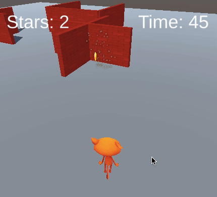
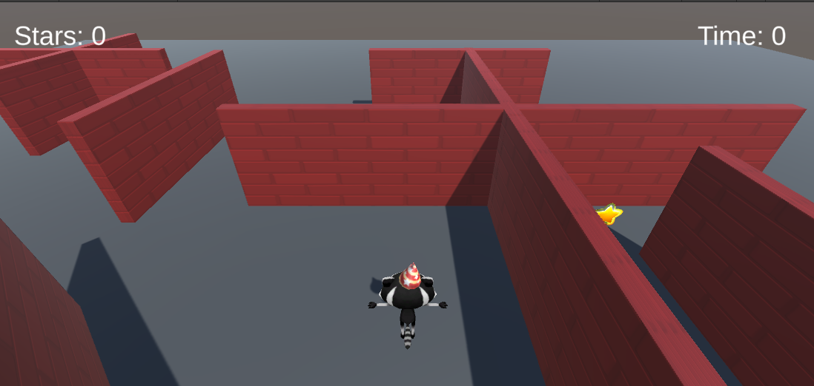

## Keeping time

Now that a player can collect stars, add a timer to show the amount of time taken to collect all three stars. 

{:width="300px"}

**Game mechanics** are a key part of game design. They are the rules that control a player's actions. A **timer** is a game mechanic that adds a challenge to video games — in fact, there are many Guinness World Records based on how quickly players can complete challenges in games!

The player needs to keep track of how long they are taking to complete the minigame, you can do this with another variable. 

--- task ---

In the Hierarchy window, right-click on your **Canvas** and from **UI** create another **Text - TextMeshPro GameObject**. You will see 'New Text' written on your screen in Game view: 

--- /task ---

--- task ---

Right-click on the new **Text (TMP) GameObject** and select **rename**. Call it `Time Text` to easily identify it:

--- /task ---

--- task ---

From the Inspector window, in the Text Input property for the new TextMeshPro GameObject, change `New Text` to `Time: 0`.

Use the **Rect Transform** component to change the alignment to **Top Right**. Also change the position to `x = -60`, `y = -50`:

--- /task ---

The text that is displayed needs to update so that it continuously shows the number of seconds since the game started.

--- task ---

Open your `StarPlayer` script and add code to create a TMP_Text Object called `timeText`: 

--- code ---
---
language: cs
filename: StarPlayer.cs
line_numbers: true
line_number_start: 6
line_highlights: 10
---
public class StarPlayer : MonoBehaviour
{
    public int stars = 0; // An integer whole number
    public TMP_Text starText;
    public TMP_Text timeText;
--- /code ---

--- /task ---

--- task ---

`Time.time` gives the time in seconds since the Scene started. `Mathf.Round` turns a number into a whole number. 

Set the text to show the number of whole seconds on each update:

--- code ---
---
language: cs
filename: StarPlayer.cs - Update()
line_numbers: true
line_number_start: 18
line_highlights: 21
---
    void Update()
    {
        starText.SetText("Stars: " + stars);
        timeText.SetText("Time: " + Mathf.Round(Time.time));
    }
--- /code ---

Save your script and go back to the Unity Editor. 

--- /task ---

--- task ---

Select the Player in the Hierarchy window and go to the `Star Player` script component in the Inspector window. Click on the circle next to `Time Text` and choose your new 'Time Text' object. 

--- /task ---

--- task ---

**Test:** Run your minigame and check that the time updates as you play. What happens when you collect all three stars? 

--- /task ---

The time needs to stop when all three stars are collected, but currently it will keep counting up for as long as the minigame is playing. 

--- task ---

Open the `StarPlayer` script and create an if statement around your time code to only count the seconds if the player has collected less than three stars:

--- code ---
---
language: cs
filename: StarPlayer.cs - Update()
line_numbers: true
line_number_start: 18
line_highlights: 21-24
---
    void Update()
    {
        starText.SetText("Stars: " + stars);
        if (stars < 3)
        {
            timeText.SetText("Time: " + Mathf.Round(Time.time));
        }
    }
--- /code ---

Save your script and go back to the Unity Editor. 

--- /task ---

--- task ---

**Test:** Run your minigame again. The timer will stop when the player has three stars: 

--- /task ---

After the Quiz, you can upgrade your project with the features you think are important. 

--- save ---
