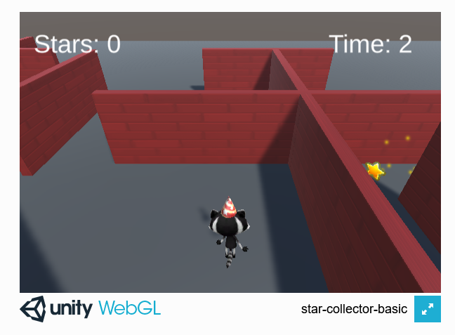

## Lo que harás

Haz un minijuego en el que recolectas estrellas brillantes que giran lo más rápido que puedas.

Este proyecto es presentado gracias al generoso apoyo de [Unity Technologies](https://unity.com/){:target="_blank"}. Estos [proyectos](https://projects.raspberrypi.org/es-LA/pathways/unity-intro){:target="_blank"} ofrecen a los jóvenes la oportunidad de dar sus primeros pasos en la creación de mundos virtuales utilizando Real-Time 3D.

Este proyecto es la continuación de [Explora un mundo 3D](https://projects.raspberrypi.org/es-LA/projects/explore-a-3d-world){:target="_blank"}. Puedes usar la escena de Unity que creaste en ese proyecto como base para este proyecto. También proporcionamos un proyecto de inicio que puedes utilizar.

Un **minijuego** es un juego corto de computadora. A menudo, los juegos de computadora más grandes contienen múltiples minijuegos. ¿Juegas algún juego que tenga minijuegos?

Vas a:

+ Usar **colliders** (colisionadores) y **triggers** (activadores) para controlar lo que pasa cuando los GameObjects colisionan
+ Agregar **sound** (sonido) y **particle effects** (efectos de partículas)
+ Crear, establecer y mostrar las **variables** de puntuación y tiempo

--- no-print ---

### Reproducir ▶️

--- task ---

Haz clic en el proyecto integrado. Intenta recoger las estrellas lo más rápido que puedas. ¿Qué tan cerca tienes que estar de una estrella para recogerla? ¿Qué pasa con el tiempo cuando terminas de recoger todas las estrellas? ¿Qué efectos gráficos tienen las estrellas?
<iframe allowtransparency="true" width="710" height="450" src="https://raspberrypilearning.github.io/unity-webgl/star-collector-basic" frameborder="0"></iframe>

--- /task ---
--- /no-print ---

--- print-only ---

--- /print-only ---
