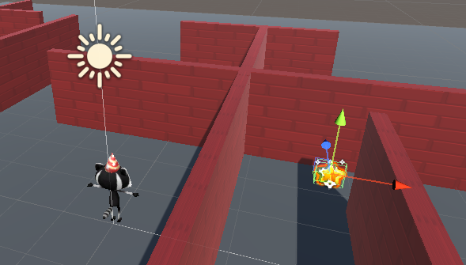

## Una estrella giratoria

Los coleccionables de este juego son estrellas que giran para llamar la atención.

{:width="300px"}

--- task ---

Inicia Unity Hub y abre el proyecto que creaste para [Explora un mundo 3D](https://projects.raspberrypi.org/en/projects/explore-a-3d-world){:target=blank}.

--- collapse ---
---
title: No tengo mi proyecto Explora un mundo 3D
---

Si no puedes abrir tu proyecto Explora un mundo 3D, puedes descargar, descomprimir e importar este [Paquete de inicio de Coleccionista de estrellas](https://rpf.io/p/en/star-collector-go){:target=blank}.

Una vez que se haya importado el paquete, ve a la carpeta Activos y haz doble clic en la escena **3D World** para cargarlo.

--- /collapse ---

[[[unity-importing-a-package]]]

--- /task ---

--- task ---

Haz clic derecho en la escena **3D World** (Mundo 3D) en la ventana Hierarchy (Jerarquía) y **Save Scene As ** (Guardar escena como) `Star Collector` (Coleccionista de estrellas).

Esto crea un archivo nuevo de Escena en la ventana Project. Las escenas en un proyecto pueden compartir Assets (activos), incluidos Scripts.

Tu proyecto ahora contiene dos escenas, pero solo trabajarás en una escena a la vez.

--- /task ---

--- task ---

El minijuego de coleccionista de estrellas necesita una vista de cámara que sea lo suficientemente alta para ver el diseño de parte del mapa, pero no demasiado alta o revelará la posición de las estrellas.

En la ventana Hierarchy, haz clic en **Player**, luego selecciona **Main Camera** (Cámara principal) y cambia la Posición y la Rotación en el componente Transform de la ventana Inspector a:

--- /task ---

--- task ---

También necesitarás agregar algunas paredes más a tu escena. Haz clic en una pared y presiona <kbd>Ctrl</kbd>+<kbd>D</kbd> para duplicar la pared.

Posiciona los muros nuevos usando las herramientas de transformación y rotación o cambiando los valores en el componente Transform. Repite esto varias veces, de modo que tengas muchos lugares para esconder estrellas.

Puedes navegar por tu escena para verla desde diferentes ángulos. Si te pierdes, haz clic en tu personaje de jugador en la ventana Hierarchy y luego usa <kbd>Shift</kbd>+<kbd>F</kbd> para enfocarte en este.

[[[unity-transform-tools]]]

[[[unity-scene-navigation]]]

--- /task ---

--- task ---

En la ventana Project, ve a la carpeta **Models** y arrastra **Star** (Estrella) a la **Scene view** (Vista de escena).

--- /task ---

--- task ---

Asegúrate de que Star GameObject esté seleccionado en la ventana Hierarchy y colócalo usando:
+ Las flechas de la herramienta Transform y de la Vista de escena
+ Las coordenadas del componente Transform en la ventana Inspector

Tu estrella debería estar fuera del suelo; la posición `y = 0.7` es más o menos correcta.

Es posible que quieras ocultar la estrella detrás de una pared para que sea más difícil de encontrar para los jugadores de tu juego:

--- /task ---

--- task ---

En la ventana Inspector, haz clic en **Add Component** y elige **New script**, luego nombra tu nuevo script `ControladorEstrella`.

Haz doble clic en `ControladorEstrella` en el componente de script para iniciar tu script en el editor.

--- /task ---

En [Explora un mundo 3D](https://projects.raspberrypi.org/en/projects/explore-a-3d-world/){: target="_blank"} usaste `transform.Rotate` para girar al jugador. Puedes usar el mismo método para hacer girar la estrella alrededor del eje y.

--- task ---

Debajo del código de clase pública, crea una variable llamada `velocidadGiro` para poder controlar la velocidad con la que gira tu estrella:

--- code ---
---
language: cs filename: ControladorEstrella.cs line_numbers: true line_number_start: 5
line_highlights: 7
---
public class ControladorEstrella : MonoBehaviour
{ float spinSpeed = 0.5f;

--- /code ---

Añade código para posicionar tu estrella:

--- code ---
---
language: cs filename: ControladorEstrella.cs - Update() line_numbers: true line_number_start: 16
line_highlights: 18
---

    void Update()
    {
        transform.Rotate(Vector3.up * spinSpeed); // Rotate about the y (up) axis
    }
--- /code ---

Guarda tu script y luego regresa al Editor de Unity.

--- /task ---

--- task ---

**Prueba:** Juega en tu escena y verifica que la estrella esté girando:

**Depuración:** Asegúrate de haber agregado el Script al GameObject de Star. Si lo agregaste accidentalmente a un GameObject diferente, puedes hacer clic en los tres puntos junto al componente Script y elige **Remove Component** (Eliminar componente).

**Depuración:** Cambia el valor de tu variable `velocidadGiro` si quieres acelerar o disminuir la velocidad a la que gira la estrella.

--- /task ---

Es hora para un particle system (sistema de partículas).

Un **particle effect** (efecto de partículas) usa muchas imágenes pequeñas, o 'partículas', para crear un efecto visual que le da vida a un juego de computadora. La próxima vez que juegues un juego de computadora, busca todos los lugares donde se usan efectos de partículas. 

--- task ---

Haz clic derecho en el **GameObject de Star** en la ventana Hierarchy y elige **Effects** y luego **Particle System**. Esto agregará un GameObject del Sistema de Partículas a la Estrella.

Agregar el Sistema de Partículas como un objeto secundario de la Estrella significa que si mueves la estrella en la vista de Escena, las partículas se moverán con ella.

--- /task ---

--- task ---

**Prueba:** Ejecuta tu código para ver efecto de partículas predeterminado. Está girando con la estrella y no es del todo correcto para una estrella brillante:

Sal del Play mode (Modo de juego).

--- /task ---

Hay muchas configuraciones que puedes usar para personalizar el Sistema de Partículas.

--- task ---

Haz clic en **Particle System** debajo de la Star (Estrella) en Hierarchy. Usa esta configuración para crear un efecto de destello que no gire con la Estrella:

**Sugerencia:** Para cerrar el selector de color, haz clic en la 'X' o haz clic en cualquier otra parte del Editor de Unity.

--- /task ---

--- task ---

**Prueba:** Haz clic en **Play** para ver el efecto.

Ajusta la configuración hasta que estés contento con el efecto de partículas.

Recuerda, puedes probar cosas en el modo Juego, pero debes salir del modo Juego para realizar los cambios que quieras conservar:

--- /task ---

¡Ahora esa estrella solo pide que la recojan!

--- save ---
