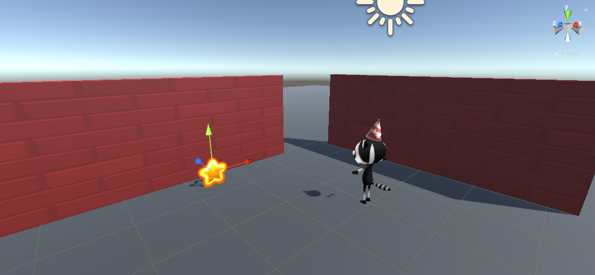

## Una estrella giratoria

Los coleccionables de este juego son estrellas que giran para llamar la atención.

{:width="300px"}

--- task ---

Inicia Unity Hub y abre el proyecto que creaste para [Explora un mundo 3D](https://projects.raspberrypi.org/en/projects/explore-a-3d-world){:target=blank}.

--- collapse ---
---
title: I haven't got my Explore a 3D world project
---

If you are not able to open your Explore a 3D world project, you can download, unzip, and import this [Star collector starter package](https://rpf.io/p/en/star-collector-go){:target=blank}.

Una vez que se haya importado el paquete, ve a la carpeta Activos y haz doble clic en la escena **3D World** para cargarlo.

--- /collapse ---

[[[unity-importing-a-package]]]

--- /task ---

--- task ---

Right-click on the **3D World** scene in the Hierarchy window and **Save Scene As** `Star Collector`.

This creates a new Scene file in the Project window. Scenes in a project can share Assets including Scripts.

Your project now contains two scenes, but you will only work on one scene at a time.

--- /task ---

--- task ---

El minijuego de coleccionista de estrellas necesita una vista de cámara que sea lo suficientemente alta para ver el diseño de parte del mapa, pero no demasiado alta o revelará la posición de las estrellas.

In the Hierarchy window, click on **Player** then select **Main Camera**, and change the Position and Rotation in the Inspector window's Transform component to:

--- /task ---

--- task ---

También necesitarás agregar algunas paredes más a tu escena. Haz clic en una pared y presiona <kbd>Ctrl</kbd>+<kbd>D</kbd> para duplicar la pared.

Position the new walls using the transform and rotate tools or by changing the values in the Transform component. Repeat this several times, so that you have plenty of places to hide stars.

Puedes navegar por tu escena para verla desde diferentes ángulos. If you get lost, click on your Player in the Hierarchy and then use <kbd>Shift</kbd>+<kbd>F</kbd> to focus on the Player.

[[[unity-transform-tools]]]

[[[unity-scene-navigation]]]

--- /task ---

--- task ---

In the Project window, go to the **Models** folder and drag the **Star** into the **Scene view**.

--- /task ---

--- task ---

Make sure the Star GameObject is selected in the Hierarchy window and position it using either:
+ The arrows from the Transform tool and the Scene view
+ The coordinates from the Transform component in the Inspector window

Tu estrella debería estar fuera del suelo; la posición `y = 0.7` es más o menos correcta.

Es posible que quieras ocultar la estrella detrás de una pared para que sea más difícil de encontrar para los jugadores de tu juego:

--- /task ---

--- task ---

In the Inspector window, click **Add Component** and choose **New script**, then name your new script `StarController`.

Double-click on `StarController` in the script component to launch your script in the editor.

--- /task ---

En [Explora un mundo 3D](https://projects.raspberrypi.org/en/projects/explore-a-3d-world/){: target="_blank"} usaste `transform.Rotate` para girar al jugador. Puedes usar el mismo método para hacer girar la estrella alrededor del eje y.

--- task ---

Underneath the public class code, create a variable called `spinSpeed` so you can control how fast your star spins:

--- code ---
---
language: cs filename: StarController.cs line_numbers: true line_number_start: 5
line_highlights: 7
---
public class StarController : MonoBehaviour
{ float spinSpeed = 0.5f;

--- /code ---

Añade código para posicionar tu estrella:

--- code ---
---
language: cs filename: StarController.cs - Update() line_numbers: true line_number_start: 16
line_highlights: 18
---

    void Update()
    {
        transform.Rotate(Vector3.up * spinSpeed); // Rotate about the y (up) axis
    }
--- /code ---

Guarda tu script y luego regresa al Editor de Unity.

--- /task ---

--- task ---

**Test:** Play your scene and check that the star is spinning:

**Debug:** Make sure you added the Script to the Star GameObject. If you accidentally added it to a different GameObject, then you can click the three dots next to the Script component and choose **Remove Component**.

**Debug:** Change the value of your `spinSpeed` variable if you want to speed up or slow down the speed at which the star spins.

--- /task ---

Time for a particle system.

A **particle effect** uses lots of small images, or 'particles', to create a visual effect that adds life to a computer game. La próxima vez que juegues un juego de computadora, busca todos los lugares donde se usan efectos de partículas. 

--- task ---

Right-click on the **Star GameObject** in the Hierarchy window and choose **Effects** then **Particle System**. Esto agregará un GameObject del Sistema de Partículas a la Estrella.

Agregar el Sistema de Partículas como un objeto secundario de la Estrella significa que si mueves la estrella en la vista de Escena, las partículas se moverán con ella.

--- /task ---

--- task ---

**Prueba:** Ejecuta tu código para ver efecto de partículas predeterminado. Está girando con la estrella y no es del todo correcto para una estrella brillante:

Exit Play mode.

--- /task ---

Hay muchas configuraciones que puedes usar para personalizar el Sistema de Partículas.

--- task ---

Click on **Particle System** beneath the Star in the Hierarchy. Usa esta configuración para crear un efecto de destello que no gire con la Estrella:

**Sugerencia:** Para cerrar el selector de color, haz clic en la 'X' o haz clic en cualquier otra parte del Editor de Unity.

--- /task ---

--- task ---

**Test:** Click **Play** to see the effect.

Ajusta la configuración hasta que estés contento con el efecto de partículas.

Recuerda, puedes probar cosas en el modo Juego, pero debes salir del modo Juego para realizar los cambios que quieras conservar:

--- /task ---

¡Ahora esa estrella solo pide que la recojan!

--- save ---
