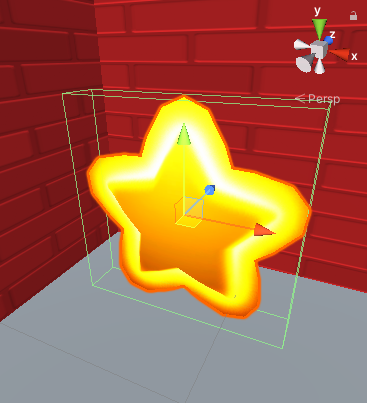
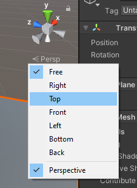

## Recolectando la estrella

La estrella debe desaparecer cuando la recojas. 

{:width="300px"}

En Unity, un Collider (Colisionador) con un **Trigger** (Activador) llama al método `OnTriggerEnter` cuando ocurre una colisión, pero no le impide al jugador entrar en el Collider.

--- task ---

Selecciona **Star** y en la ventana Inspector, haz clic en **Add Component**. Comienza a escribir `box` hasta que veas **Box Collider** y haz clic en este. Se agregará un nuevo componente a la estrella en la ventana Inspector.

Marca la casilla **Is Trigger**.

Haz clic en <kbd>Shift</kbd>+<kbd>F</kbd> para enfocarte en la Estrella en la Vista de escena. Verás un contorno de cuadro verde alrededor de la Estrella: esto muestra el contorno del Colisionador. Si el Colisionador del jugador ingresa a esta área, habrá una colisión y se llamará `OnTriggerEnter`:

--- /task ---

Solo quieres que se recoja la estrella si el GameObject que ha chocado con ella es el Jugador. Unity usa **Tags** (Etiquetas) para etiquetar GameObjects. Unity incluye una Player tag (Etiqueta de jugador).

--- task ---

Selecciona tu GameObject **Player** y asígnale el Tag `Player` (Jugador) usando el menú desplegable:

--- /task ---

--- task ---

Abre tu script de ControladorEstrella cambiando a tu editor de código o haciendo doble clic en el script en tu carpeta **My Scripts** desde la ventana Project.

Agrega un método nuevo `OnTriggerEnter` debajo del corchete de cierre `}` del método `Update` pero antes del corchete de cierre `}` de la clase `ControladorEstrella`:

--- code ---
---
language: cs filename: StarController.cs - OnTriggerEnter(Collider other) line_numbers: true line_number_start: 16
line_highlights: 20-27
---

    void Update()
    {
        transform.Rotate(Vector3.up * spinSpeed); // Rotate about the y (up) axis
    }
    void OnTriggerEnter(Collider other)
    {
        // Check the tag of the colliding object
        if (other.CompareTag("Player"))
        {
            gameObject.SetActive(false);
        }
    }
}    
--- /code ---

Guarda tu script.

--- /task ---

--- task ---

**Prueba:** Juega tu proyecto. Camina hacia la estrella para verla desaparecer.

**Depuración:** ¡Asegúrate de haber agregado la etiqueta Player a tu GameObject de Jugador y no a la Estrella!

--- /task ---

Agregar un efecto de sonido hace que recolectar una estrella sea más satisfactorio para el jugador.

--- task ---

Add a `public collectSound` variable to your `StarController` script to store the sound that you want to play:

--- code ---
---
language: cs filename: StarController.cs line_numbers: true line_number_start: 5
line_highlights: 8
---
public class ControladorEstrella : MonoBehaviour
{ float spinSpeed = 0.5f; public AudioClip collectSound;

--- /code ---

**Tip:** Making a variable `public` means you can assign it in the Inspector and access it from other GameObjects.

--- /task ---

--- task ---

Agrega una línea al método `OnTriggerEnter` para reproducir el sonido en la ubicación de la estrella. El método `AudioSource.PlayClipAtPoint` reproducirá el sonido:

--- code ---
---
language: cs filename: ControladorEstrella.cs - OnTriggerEnter(Collider other) line_numbers: true line_number_start: 21
line_highlights: 26
---

    void OnTriggerEnter(Collider other)
    {
        // Check the tag of the colliding object
        if (other.CompareTag("Player"))
        {
            AudioSource.PlayClipAtPoint(collectSound, transform.position);
            gameObject.SetActive(false);
        }
--- /code ---

Guarda tu código.

--- /task ---

--- task ---

Vuelve al Editor de Unity y haz clic en **GameObject de Star** en la ventana Hierarchy.

Encuentra la propiedad **Collect Sound** del componente de script de ControladorEstrella de la Estrella en la ventana Inspector.

Haz clic en el círculo a la derecha de la propiedad Collect Sound y elige el sonido **Collect**:

--- /task ---

--- task ---

**Prueba:** Juega tu escena y recoge la estrella para escuchar el sonido.

**Debug:** If you get an error that says `The variable collectSound of StarController has not been assigned.` this means you have not set the audio clip in the Inspector:
* Make sure the `collectSound` variable is `public`
* Find the `StarCollector` component in the Inspector of your Star, click the circle and select the `Collect` sound clip from the pop up window. --- /task ---

Tu juego necesita más estrellas.

--- task ---

Selecciona tu Estrella en la vista de Escena y duplícala con <kbd>Ctrl</kbd>+<kbd>D</kbd> (o <kbd>Cmd</kbd>+<kbd>D</kbd>). El Sistema de Partículas es un objeto secundario, por lo que se duplicará en tu nueva estrella:

La nueva estrella aparecerá en la misma posición, así que arrástrala a un nuevo escondite en la escena. El Sistema de Partículas secundario se moverá con la estrella.

Para ver tu mapa en una vista de arriba hacia abajo, haz clic con el botón derecho donde dice **Persp** en la esquina superior derecha de la Vista de escena y elige **Top**. Para volver a la vista normal, haz clic derecho en **Top** y elige **Free**:

Puedes usar las flechas del teclado para moverte hacia la izquierda, hacia la derecha y hacer zoom. Mantén presionado el botón derecho del ratón y arrastra para mover y girar.

Repite esto para que tengas tres estrellas escondidas en tu mapa:

--- /task ---

--- task ---

**Test:** Play your scene and collect all the stars. Make sure they all disappear and play a sound when collected.

--- /task ---

--- save ---
