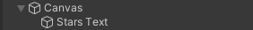

## Contando estrellas

Los juegos a menudo muestran información de estado, como una puntuación. Tú mostrarás el número de estrellas que has recogido hasta el momento.

{:width="300px"}

Un GameObject (Objeto de juego) de Unity puede tener varios scripts. Agregarás un nuevo script al reproductor para almacenar y mostrar la cantidad de estrellas que tiene.

El jugador necesita realizar un seguimiento de cuántas estrellas ha recolectado, esto puedes hacerlo con una variable.

--- task ---

Selecciona **Player** y en el Inspector haz clic en **Add Component** y crea un nuevo script llamado `JugadorEstrella`. Abre tu nuevo script en el editor de código y crea una nueva variable llamada `estrellas`:

--- code ---
---
language: cs filename: StarPlayer.cs line_numbers: true line_number_start: 5
line_highlights: 7
---
public class StarPlayer : MonoBehaviour
{ public int stars = 0; // An integer whole number // Start is called before the first frame update void Start()
    { --- /code ---

Guarda tu script y regresa al Editor de Unity.

--- /task ---

El script `ControladorEstrella` necesita actualizar la variable `estrellas` en el Player cada vez que se recoge una estrella.

--- task ---

Abre tu script `ControladorEstrella` y agrega código para aumentar la cantidad de estrellas que tiene el jugador en 1 cada vez que se recolecta una estrella.

El parámetro `other` del método `OnTriggerEnter` se establece en el GameObject que ha colisionado con la estrella. Puedes usarlo para acceder a la variable `estrellas` de `JugadorEstrella`:

--- code ---
---
language: cs filename: StarController.cs - OnTriggerEnter(Collider other) line_numbers: true line_number_start: 21
line_highlights: 26, 27
---

    void OnTriggerEnter(Collider other)
    {
        // Check the tag of the colliding object
        if (other.CompareTag("Player"))
        {
            StarPlayer player = other.gameObject.GetComponent<StarPlayer>();
            player.stars += 1; // Increase by 1
            AudioSource.PlayClipAtPoint(collectSound, transform.position);
            gameObject.SetActive(false);
        }
    }
--- /code ---

Guarda tu script y regresa al Editor de Unity.

--- /task ---

--- task ---

**Prueba:** Ejecuta tu escena y recoge las tres estrellas. Mira la variable pública `estrellas` en la ventana Inspector del jugador para verificar que el número aumenta en 1 cada vez que obtiene una estrella:

**Depuración:** Si no ves la variable `estrellas` en el Inspector, asegúrate de haber guardado tu script `JugadorEstrella.cs`.

--- /task ---

Poder ver cuántas estrellas se han recolectado es excelente para tus pruebas, pero los usuarios no lo podrán ver.

**UI** o elementos de la interfaz de usuario permiten que un proyecto de Unity use objetos que incluyen texto, botones o controles deslizantes para comunicarse e interactuar con el usuario o jugador. Los elementos de la interfaz de usuario se utilizan a menudo para las pantallas de inicio y la configuración del juego y para brindar información al usuario y permitirle tomar decisiones. 

--- task ---

Haz clic derecho en la ventana Hierarchy y ve a **UI** y luego selecciona **Text - TextMeshPro**. Esto crea un lienzo con un objeto de texto secundario; puedes ver el texto en la vista **Game view**:

--- collapse ---

---
title: First time using TextMeshPro pop-up
---

Es posible que veas una ventana emergente que te pide que importes elementos esenciales, ejemplos y extras de TextMeshPro a tu proyecto. Si este es el caso, haz clic en los dos botones **Import** a la vez, luego cierra la ventana:

--- /collapse ---

--- /task ---

--- task ---

Haz clic derecho en el nuevo **Text- (TMP) GameObject** y selecciona `rename`. Llámalo `Texto de Estrellas ` para identificarlo fácilmente:

--- /task ---

--- task ---

En la ventana Inspector, para TextMeshPro GameObject, ve al componente **Text Input**. Cambia `New Text` a `Estrellas: 0`:

--- /task ---

--- task ---

En el componente **Rect Transform**, haz clic y cambia la alineación a **Top Left** (Arriba a la izquierda). Y cambia la posición a `x = 120`, `y = -50`.

Esto colocará el centro de tu texto 120 píxeles desde la izquierda y -50 píxeles desde la parte superior. El texto permanecerá en su posición si cambias el tamaño de la vista del juego:

**Sugerencia:** Puedes ver la posición del texto en la vista de juego incluso cuando no estás en el modo de juego.

--- /task ---

Ahora debes actualizar el texto que se muestra para que muestre la cantidad actual de estrellas recolectadas por el jugador.

--- task ---

Abre tu script `JugadorEstrella` y agrega `using TMPro` en la parte superior para que tu script pueda usar `TMP_Text`:

--- code ---
---
language: cs filename: StarPlayer.cs line_numbers: true line_number_start: 1
line_highlights: 4
---
using System.Collections; using System.Collections.Generic; using UnityEngine; using TMPro; --- /code ---

--- /task ---

--- task ---

Agrega código para crear un objeto TMP_Text llamado `textoEstrella`:

--- code ---
---
language: cs filename: StarPlayer.cs line_numbers: true line_number_start: 6
line_highlights: 9
---
public class StarPlayer : MonoBehaviour
{ public int stars = 0; // An integer whole number public TMP_Text starText; // Start is called before the first frame update --- /code ---

--- /task ---

--- task ---

Usa el método `SetText` de la clase `TMP_Text` para mostrar la cantidad de estrellas recolectadas en cada actualización:

--- code ---
---
language: cs filename: StarPlayer.cs - Update() line_numbers: true line_number_start: 16
line_highlights: 21
---
public class StarPlayer : MonoBehaviour
{
    // Update is called once per frame
    void Update()
    {
        starText.SetText("Stars: " + stars);
    }
--- /code ---

Guarda tu secuencia de comandos y regresa al Editor de Unity.

--- /task ---

--- task ---

En la ventana Inspector del jugador para el script `JugadorEstrella`, haz clic en el círculo junto a la propiedad Star Text y elige **Texto Estrellas** para vincular tu objeto de texto.

--- /task ---

--- task ---

Play your scene and check that the number in the UI text increases each time you collect a star:

--- /task ---

--- save ---

