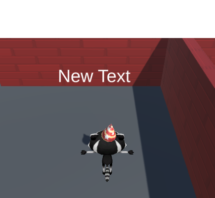

## Controlando el tiempo

Ahora que un jugador puede recolectar estrellas, agrega un cronómetro para mostrar la cantidad de tiempo necesario para recolectar las tres estrellas. 

{:width="300px"}

**La mecánica del juego** es una parte clave del diseño del juego. Son las reglas que controlan las acciones de un jugador. Un **cronómetro** es una mecánica de juego que agrega un desafío a los videojuegos; de hecho, ¡hay muchos récords mundiales Guinness basados en la rapidez con la que los jugadores pueden completar desafíos en los juegos!

El jugador necesita realizar un seguimiento de cuánto tiempo tarda en completar el minijuego, puede hacerlo con otra variable.

--- task ---

En la ventana Hierarchy, haz clic con el botón derecho en tu **Canvas** y desde la interfaz de usuario crea otro **Text - TextMeshPro GameObject**. Verás 'New text' escrito en su pantalla en la vista de Juego:

--- /task ---

--- task ---

Haz clic derecho en el nuevo **Text- (TMP) GameObject** y selecciona **rename**. Llámalo `Tiempo Texto` para identificarlo fácilmente:

--- /task ---

--- task ---

Desde la ventana Inspector, en la propiedad Text Input para el nuevo TextMeshPro GameObject, cambia `New Text` a `Tiempo: 0`.

Utilice el componente **Rect Transform** para cambiar la alineación a **Top Right**. También cambia la posición a `x = -60`, `y = -50`:

--- /task ---

El texto que se muestra debe actualizarse para que muestre continuamente la cantidad de segundos desde que comenzó el juego.

--- task ---

Abra tu secuencia de comandos `JugadorEstrella` y agrega código para crear un objeto TMP_Text llamado `tiempoTexto`:

--- code ---
---
language: cs filename: StarPlayer.cs line_numbers: true line_number_start: 6
line_highlights: 10
---
public class StarPlayer : MonoBehaviour
{ public int stars = 0; // An integer whole number public TMP_Text starText; public TMP_Text timeText; --- /code ---

--- /task ---

--- task ---

`Time.time` proporciona el tiempo en segundos desde que comenzó la escena. `Mathf.Round` convierte un número en un número entero.

Configura el texto para mostrar la cantidad de segundos completos en cada actualización:

--- code ---
---
language: cs filename: StarPlayer.cs - Update() line_numbers: true line_number_start: 18
line_highlights: 21
---

    void Update()
    {
        starText.SetText("Stars: " + stars);
        timeText.SetText("Time: " + Mathf.Round(Time.time));
    }
--- /code ---

Guarda tu secuencia de comandos y regresa al Editor de Unity.

--- /task ---

--- task ---

Selecciona el reproductor en la ventana Hierarchy y ve al componente de secuencia de comandos `JugadorEstrella` en la ventana Inspector. Haz clic en el círculo junto a `Tiempo Texto` y elige tu nuevo objeto 'Tiempo Texto'.

--- /task ---

--- task ---

**Prueba:** Ejecuta tu minijuego y comprueba que el tiempo se actualiza a medida que juegas. ¿Qué pasa cuando recoges las tres estrellas?

--- /task ---

El tiempo debe detenerse cuando se recolectan las tres estrellas, pero actualmente seguirá contando mientras se juegue el minijuego.

--- task ---

Abre el script `JugadorEstrella` y crea una declaración if alrededor de tu código de tiempo para contar los segundos solo si el jugador ha acumulado menos de tres estrellas:

--- code ---
---
language: cs filename: StarPlayer.cs - Update() line_numbers: true line_number_start: 18
line_highlights: 21-24
---

    void Update()
    {
        starText.SetText("Stars: " + stars);
        if (stars < 3)
        {
            timeText.SetText("Time: " + Mathf.Round(Time.time));
        }
    }
--- /code ---

Guarda tu script y regresa al Editor de Unity.

--- /task ---

--- task ---

**Prueba:** Vuelve a ejecutar tu minijuego. El cronómetro se detendrá cuando el jugador tenga tres estrellas:

--- /task ---

Después del paso de Reflexión, puedes actualizar tu proyecto con las funciones que consideres importantes.

--- save ---
