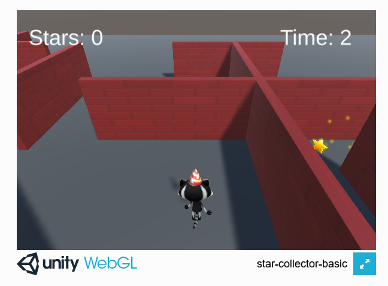

## You will make

Crée un mini-jeu dans lequel tu dois collecter des étoiles tournantes aussi vite que possible.

Ce projet t'est présenté grâce au soutien généreux de [Unity Technologies](https://unity.com/){:target="_blank"}.  Ces [projets](https://projects.raspberrypi.org/en/pathways/unity-intro){:target="_blank"} proposent aux jeunes de faire leurs premiers pas dans la création de mondes virtuels en 3D temps réel.

Ce projet fait suite à [Explorer un monde en 3D](https://projects.raspberrypi.org/en/projects/explore-a-3d-world){:target="_blank"}. Tu peux utiliser la scène Unity que tu as créée dans ce projet comme base pour ce projet. Nous avons également fourni un projet de démarrage que tu peux utiliser.

Un **mini-jeu** est un jeu informatique court. Les jeux informatiques de grande envergure contiennent souvent plusieurs mini-jeux. Joues-tu à des jeux qui contiennent des mini-jeux ?

Tu vas :

+ Utiliser des **colliders** et des **triggers** pour contrôler ce qui se passe lorsque les GameObjects entrent en collision
+ Ajouter **sound** et **particle effects**
+ Créer, définir et afficher des **variables** de score et de temps

--- no-print ---

### Play ▶️

--- task ---

Click on the embedded project. Try and collect the stars as fast as you can. How close do you have to be to a star to collect it? What happens to the time when you have collected all of the stars? What graphic effects do the stars have?
<iframe allowtransparency="true" width="710" height="450" src="https://star-collector-basic.rpfilt.repl.co" frameborder="0"></iframe>

--- /task --- --- /no-print ---

--- print-only ---

--- /print-only ---
