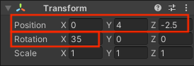
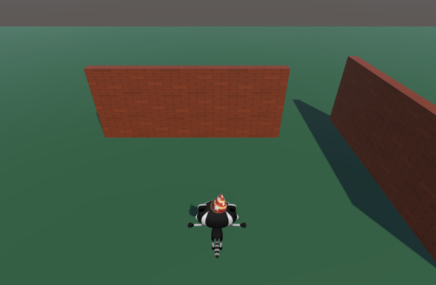
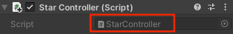

## Une étoile tournante

Les objets de collection de ce jeu sont des étoiles qui tournent pour attirer l'attention.

{:width="300px"}

--- task ---

Lance Unity Hub et ouvre le projet que tu as créé pour [Explorer un monde en 3D](https://projects.raspberrypi.org/en/projects/explore-a-3d-world){:target=blank}.

--- collapse ---
---
title: Je n'ai pas mon projet Explorer un monde en 3D
---

Si tu ne parviens pas à ouvrir ton projet Explorer un monde en 3D, tu peux télécharger, décompresser et importer ce package de démarrage [Collectionneur d'étoiles](https://rpf.io/p/en/star-collector-go){:target=blank}.

Une fois le package importé, accède au dossier Assets et double-clique sur la scène **3D World** pour la charger.

--- /collapse ---

[[[unity-importing-a-package]]]

--- /task ---

--- task ---

Fais un clic droit sur la scène **3D World** dans la fenêtre Hierarchy et **Save Scene As** `Star Collector`.

Cela crée un nouveau fichier de scène dans la fenêtre Project. Les scènes d'un projet peuvent partager des Assets, y compris des scripts.

Ton projet contient maintenant deux scènes, mais tu ne travailleras que sur une scène à la fois.

--- /task ---

--- task ---

Le mini-jeu Collecteur d'étoiles nécessite une vue caméra suffisamment haute pour voir la disposition de certaines parties de la carte, mais pas trop haute, car elle révélerait la position des étoiles.

Dans la fenêtre Hierarchy, clique sur **Player** puis sélectionne **Main Camera** et change la Position et la Rotation dans le composant Transform de la fenêtre Inspector en :

--- /task ---

--- task ---

Tu dois également ajouter quelques murs supplémentaires à ta scène. Clique sur un mur et appuie sur <kbd>Ctrl</kbd>+<kbd>D</kbd> pour dupliquer le mur.

Positionne les nouveaux murs à l'aide des outils de transformation et de rotation ou en modifiant les valeurs dans le composant Transform. Répète cette opération plusieurs fois, afin d'avoir suffisamment d'endroits pour cacher les étoiles.

Tu peux te déplacer dans ta scène pour la voir sous différents angles. Si tu te perds, clique sur ton Player dans Hierarchy, puis utilise <kbd>Maj</kbd>+<kbd>F</kbd> pour te centrer sur le Player.

[[[unity-transform-tools]]]

[[[unity-scene-navigation]]]

--- /task ---

--- task ---

Dans la fenêtre Project, va dans le dossier **Models** et fais glisser **Star** dans la vue **Scene**.

--- /task ---

--- task ---

Assure-toi que le GameObject Star est sélectionné dans la fenêtre Hierarchy et positionne-le en utilisant soit :
+ Les flèches de l'outil Transform et de la vue Scene
+ Les coordonnées du composant Transform dans la fenêtre Inspector

Ton étoile doit être au-dessus du sol ; la position `y = 0.7` est à peu près correcte.

Tu voudras peut-être cacher l'étoile derrière un mur pour qu'il soit plus difficile pour les joueurs de ton jeu de la trouver :

--- /task ---

--- task ---

Dans la fenêtre Inspector, clique sur **Add Component** et choisis **New script**, puis nomme ton nouveau script `ControlleurEtoile`.

--- /task ---

--- task ---

Double-clique sur `ControlleurEtoile` dans le composant script pour lancer ton script dans l'éditeur.

--- /task ---

Dans [Explorer un monde en 3D](https://projects.raspberrypi.org/en/projects/explore-a-3d-world/){:target="_blank"}, tu as utilisé `transform.Rotate` pour faire tourner le Player. Tu peux utiliser la même méthode pour faire tourner l'étoile autour de l'axe y.

--- task ---

Sous le code de la classe publique, crée une variable appelée `Vitesserotation` afin de pouvoir contrôler la vitesse de rotation de ton étoile :

--- code ---
---
language: cs filename: ControlleurEtoile.cs line_numbers: true line_number_start: 5
line_highlights: 7
---
public class ControlleurEtoile : MonoBehaviour
{ float Vitesserotation = 0.5f;

--- /code ---

Ajoute du code pour faire tourner ton étoile :

--- code ---
---
language: cs filename: ControlleurEtoile.cs - Update() line_numbers: true line_number_start: 16
line_highlights: 18
---

    void Update()
    {
        transform.Rotate(Vector3.up * spinSpeed); // Rotate about the y (up) axis
    }
--- /code ---

Enregistre ton script puis reviens à l'éditeur Unity.

--- /task ---

--- task ---

**Test :** Joue ta scène et vérifie que l'étoile tourne :

**Debogage :** Assure-toi d'avoir ajouté le script au GameObject Star. Si tu l'as accidentellement ajouté à un autre GameObject, tu peux cliquer sur les trois points à côté du composant Script et choisir **Remove Component**.

**Debogage :** Modifie la valeur de ta variable `Vitesserotation` si tu souhaites accélérer ou ralentir la vitesse de rotation de l'étoile.

--- /task ---

Il est temps de mettre en place un système de particules.

Un **particle effect** utilise de nombreuses petites images, ou « particules », pour créer un effet visuel qui donne vie à un jeu vidéo. La prochaine fois que tu joueras à un jeu vidéo, recherche tous les endroits où les effets de particules sont utilisés. 

--- task ---

Fais un clic droit sur le **GameObject Star** dans la fenêtre Hierarchy et choisis **Effects** puis **Particle System**. Cela ajoutera un GameObject Particle System à l'étoile.

L'ajout du système de particules en tant qu'objet enfant de l'étoile signifie que si tu déplaces l'étoile dans la vue Scene, les particules se déplaceront avec elle.

--- /task ---

--- task ---

**Test :** Joue ta scène pour voir l'effet de particules par défaut. Il tourne avec l'étoile et ce n'est pas tout à fait correct pour une étoile scintillante :

Quitte le mode Play.

--- /task ---

Il existe de nombreux paramètres que tu peux utiliser pour personnaliser le système de particules.

--- task ---

Clique sur **Particle System** sous l'étoile dans Hierarchy. Utilise ces paramètres pour créer un effet scintillant qui ne tourne pas avec l'étoile :

**Astuce :** Pour fermer le sélecteur de couleurs, clique sur le "X" ou clique ailleurs dans l'éditeur Unity.

--- /task ---

--- task ---

**Test :** Clique sur **Play** pour voir l'effet.

Ajuste les paramètres jusqu'à ce que tu sois satisfait de l'effet de particules.

N'oublie pas que tu peux essayer des choses en mode Play, mais tu dois quitter le mode Play pour apporter les modifications que tu souhaites conserver :

--- /task ---

Maintenant, cette étoile ne demande qu'à être collectée !

--- save ---
