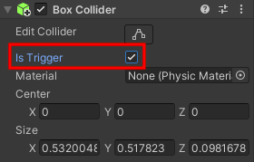
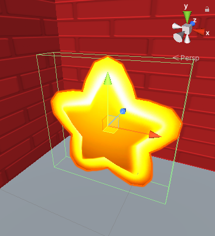
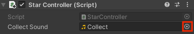

## Collecter l'étoile

L'étoile doit disparaître lorsque tu la collecte. 

{:width="300px"}

Dans Unity, un Collider avec un **Trigger** appelle la méthode `OnTriggerEnter` lorsqu'une collision se produit, mais cela n'empêche pas un joueur d'entrer dans le Collider.

--- task ---

Sélectionne **Star** et dans la fenêtre Inspector, clique sur **Add Component**. Commence à taper `box` jusqu'à ce que tu vois **Box Collider** et clique dessus. Un nouveau composant sera ajouté à l'étoile dans la fenêtre Inspector.

Coche la case **Is Trigger**.

Clique sur <kbd>Maj</kbd>+<kbd>F</kbd> pour centrer la vue sur l'étoile dans la vue Scene. Tu verras un cadre vert autour de l'étoile : il s'agit du contour du Collider. Si le Collider du joueur entre dans cette zone, alors il y aura une collision et `OnTriggerEnter` sera appelé :

--- /task ---

Tu ne veux que l'étoile soit collectée que si le GameObject qui est entré en collision avec elle est le Player. Unity utilise des **Tags** pour étiqueter les GameObjects. Unity inclut une tag Player.

--- task ---

Sélectionne ton GameObject **Player** et définis son Tag sur `Player` à l'aide du menu déroulant :

--- /task ---

--- task ---

Ouvre ton script StarController en passant à ton éditeur de code ou en double-cliquant sur le script dans ton dossier **My scripts** depuis la fenêtre Project.

Ajoute une nouvelle méthode `OnTriggerEnter` sous le `}` de fermeture de la méthode `Update` mais avant le `}` de fermeture de la classe `StarController` :

--- code ---
---
language: cs
filename: StarController.cs - OnTriggerEnter(Collider other)
line_numbers: true
line_number_start: 16
line_highlights: 20-27
---
    void Update()
    {
        transform.Rotate(Vector3.up * spinSpeed); // Rotation autour de l'axe y (haut)
    }
    void OnTriggerEnter(Collider other)
    {
        // Vérifie l'étiquette de l'objet en collision
        if (other.CompareTag("Player"))
        {
            gameObject.SetActive(false);
        }
    }
}
--- /code ---

Enregistre ton script.

--- /task ---

--- task ---

**Test :** Joue ton projet. Entre dans l'étoile pour la voir disparaître.

**Debogage :** Assure-toi d'avoir ajouté le tag Player à ton GameObject Player et non à l'étoile !

--- /task ---

L'ajout d'un effet sonore rend la collecte d'une étoile plus satisfaisante pour le joueur.

--- task ---

Ajoute une variable publique `collectSound` à ton script `StarController` pour stocker le son que tu souhaites jouer :

--- code ---
---
language: cs
filename: StarController.cs
line_numbers: true
line_number_start: 5
line_highlights: 8
---
public class StarController : MonoBehaviour
{
    float spinSpeed = 0.5f;
    public AudioClip collectSound;

--- /code ---

Rendre une variable `publique` signifie que tu peux l'affecter dans Inspector et y accéder à partir d'autres GameObjects.

--- /task ---

--- task ---

Ajoute une ligne à la méthode `OnTriggerEnter` pour jouer le son à l'emplacement de l'étoile. La méthode `AudioSource.PlayClipAtPoint` jouera le son :

--- code ---
---
language: cs
filename: StarController.cs - OnTriggerEnter(Collider other)
line_numbers: true
line_number_start: 21
line_highlights: 26
---
    void OnTriggerEnter(Collider other)
    {
        // Vérifie l'étiquette de l'objet en collision
        if (other.CompareTag("Player"))
        {
            AudioSource.PlayClipAtPoint(collectSound, transform.position);
            gameObject.SetActive(false);
        }
--- /code ---

Enregistre ton code.

--- /task ---

--- task ---

Reviens à l'éditeur Unity et clique sur le **GameObject Star** dans la fenêtre Hierarchy.

Recherche la propriété **Collect Sound** du composant de script StarController dans la fenêtre Inspector.

Clique sur le cercle à droite de la propriété Collect Sound et choisis le son **Collect** :

--- /task ---

--- task ---

**Test :** Joue ta scène et collecte l'étoile pour entendre le son.

--- /task ---

Ton jeu a besoin de plus d'étoiles.

--- task ---

Sélectionne ton étoile dans la vue Scene et duplique-la avec <kbd>Ctrl</kbd>+<kbd>D</kbd> (ou <kbd>Cmd</kbd>+<kbd>D</kbd>). Le système de particules est un objet enfant, il sera donc dupliqué dans ta nouvelle étoile :

La nouvelle étoile apparaîtra dans la même position, alors fais-la glisser vers une nouvelle position cachée dans la scène. Le système de particules enfant se déplacera avec l'étoile.

Pour voir ta map dans une vue descendante, clique avec le bouton droit de la souris là où il est indiqué **Persp** en haut à droite de la vue Scene et choisis **Top**. Pour revenir à la vue normale, fais un clic droit sur **Top** et choisis **Free** :

Tu peux utiliser les touches fléchées pour te déplacer à gauche et à droite et zoomer. Maintiens le bouton droit de la souris enfoncé et fais glisser pour déplacer et faire pivoter.

Répéte ceci pour avoir trois étoiles cachées sur ta map :

--- /task ---

--- task ---

**Test :** Joue ta scène et collecte toutes les étoiles, assure-toi qu'elles disparaissent toutes et jouent un son lorsqu'elles sont collectées.

--- /task ---

--- save ---
