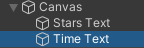

## Conserver le temps

Maintenant qu'un joueur peut collecter des étoiles, ajoute un chronomètre pour indiquer le temps nécessaire pour collecter les trois étoiles. 

{:width="300px"}

**Les mécanismes de jeu** sont un élément clé de la conception d'un jeu. Ce sont les règles qui contrôlent les actions d'un joueur. Un **chronomètre** est un mécanisme de jeu qui ajoute un défi aux jeux vidéo. En fait, il existe de nombreux records du monde Guinness basés sur la rapidité avec laquelle les joueurs peuvent relever des défis dans les jeux !

Le joueur doit garder une trace du temps qu'il met pour terminer le mini-jeu, tu peux le faire avec une autre variable.

--- task ---

Dans la fenêtre Hierarchy, clique avec le bouton droit sur ton **Canvas** et à partir de UI, crée un autre **Text - TextMeshPro GameObject**. Tu verras "New text" écrit sur ton écran en vue Game :

--- /task ---

--- task ---

Fais un clic droit sur le nouveau **Text (TMP) GameObject** et sélectionne **rename**. Appelle-le `Time Text` pour l'identifier facilement :

--- /task ---

--- task ---

Dans la fenêtre Inspector, dans la propriété Text Input du nouveau TextMeshPro GameObject, remplace `New Text` par `Time: 0`.

Utilise le composant **Rect Transform** pour changer l'alignement en **Top Right**. Modifie également la position en `x = -60`, `y = -50` :

--- /task ---

Le texte affiché doit être mis à jour afin d'afficher en continu le nombre de secondes écoulées depuis le début du jeu.

--- task ---

Ouvre ton script `StarPlayer` et ajoute du code pour créer un objet TMP_Text appelé `timeText` :

--- code ---
---
language: cs
filename: StarPlayer.cs
line_numbers: true
line_number_start: 6
line_highlights: 10
---
public class StarPlayer : MonoBehaviour
{
    public int stars = 0; // Un nombre entier
    public TMP_Text starText;
    public TMP_Text timeText;
--- /code ---

--- /task ---

--- task ---

`Time.time` donne le temps en secondes depuis le démarrage de la scène. `Mathf.Round` transforme un nombre en un nombre entier.

Définis le texte pour afficher le nombre de secondes entières sur chaque mise à jour :

--- code ---
---
language: cs
filename: StarPlayer.cs - Update()
line_numbers: true
line_number_start: 18
line_highlights: 21
---
    void Update()
    {
        starText.SetText("Stars: " + stars);
        timeText.SetText("Time: " + Mathf.Round(Time.time));
    }
--- /code ---

Enregistre ton script et reviens à l'éditeur Unity.

--- /task ---

--- task ---

Sélectionne le joueur dans la fenêtre Hierarchy et accéde au composant de script `Star Player` dans la fenêtre Inspector. Clique sur le cercle à côté de `Time Text` et choisis ton nouvel objet "Time Text".

--- /task ---

--- task ---

**Test :** Exécute ton mini-jeu et vérifie que le temps se met à jour au fur et à mesure que tu joues. Que se passe-t-il lorsque tu collectes les trois étoiles ?

--- /task ---

Le temps doit s'arrêter lorsque les trois étoiles sont collectées, mais actuellement, il continuera à compter tant que le mini-jeu se déroulera.

--- task ---

Ouvre le script `StarPlayer` et crée une instruction if autour de ton code temporel pour ne compter les secondes que si le joueur a collecté moins de trois étoiles :

--- code ---
---
language: python
filename: StarPlayer.cs - Update()
line_numbers: true
line_number_start: 18
line_highlights: 21-24
---
    void Update()
    {
        starText.SetText("Stars: " + stars);
        if (stars < 3)
        {
            timeText.SetText("Time: " + Mathf.Round(Time.time));
        }
    }
--- /code ---

Enregistre ton script et reviens à l'éditeur Unity.

--- /task ---

--- task ---

**Test :** Exécute à nouveau ton mini-jeu. Le chronomètre s'arrêtera lorsque le joueur aura trois étoiles :

--- /task ---

Après l'étape de réflexion, tu peux mettre à niveau ton projet avec les fonctionnalités que tu juges importantes.

--- save ---
