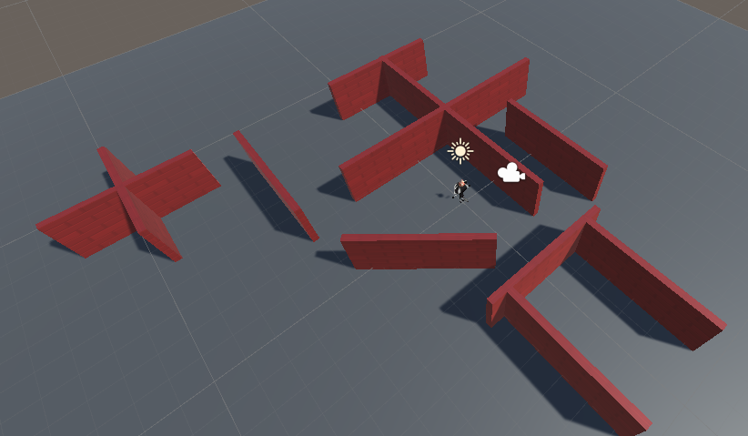

## एक घूमता हुआ तारा

इस खेल में एकत्रित करने वाले तारे ऐसे तारे हैं जो ध्यान आकर्षित करने के लिए स्पिन करते हैं।

{:width="300px"}

--- task ---

एकता हब लॉन्च करें और आपके द्वारा [Explore a 3D world](https://projects.raspberrypi.org/en/projects/explore-a-3d-world){:target=blank} के लिए बनाया गया प्रोजेक्ट खोलें।

--- collapse ---
---
title: मुझे मेरा 3D वर्ल्ड प्रोजेक्ट का अन्वेषण करने के लिए नहीं मिला है
---

यदि आप अपने 3D वर्ल्ड प्रोजेक्ट का अन्वेषण करने में सक्षम नहीं हैं, तो आप इसे डाउनलोड, अनज़िप कर सकते हैं, और इसे आयात कर सकते हैं [Star Collector स्टार्टर पैकेज](https://rpf.io/p/en/star-collector-go){:target=blank}।

पैकेज को आयात करने के बाद, संपत्ति फ़ोल्डर में जाएं और इसे लोड करने के लिए **3D वर्ल्ड** दृश्य पर डबल-क्लिक करें।

--- /collapse ---

[[[unity-importing-a-package]]]

--- /task ---

--- task ---

पदानुक्रम विंडो में **3D World** दृश्य पर राइट-क्लिक करें और **दृश्य को** के रूप में सहेजें `Star Collector`।

यह प्रोजेक्ट विंडो में एक नई दृश्य फ़ाइल बनाता है। किसी प्रोजेक्ट के दृश्य स्क्रिप्ट सहित संपत्ति को साझा कर सकते हैं।

आपके प्रोजेक्ट में अब दो दृश्य हैं, लेकिन आप एक समय में केवल एक दृश्य पर काम करेंगे।

--- /task ---

--- task ---

स्टार कलेक्टर मिनीगेम को एक कैमरा दृश्य की आवश्यकता है जो नक्शे के कुछ लेआउट को देखने के लिए पर्याप्त उच्च है लेकिन बहुत अधिक नहीं है या यह सितारों की स्थिति को प्रकट करेगा।

पदानुक्रम विंडो में, **Player** पर क्लिक करें, फिर **मुख्य कैमरा** चुनें, और निरीक्षक विंडो के रूपांतरण घटक में स्थिति और रोटेशन को बदलें:

--- /task ---

--- task ---

आपको अपने दृश्य में कुछ और दीवारें जोड़ने की भी आवश्यकता होगी। दीवार पर क्लिक करें और दीवार को डुप्लिकेट करने के लिए <kbd>Ctrl</kbd>+<kbd>D</kbd> दबाएं।

नई दीवारों को रूपांतरित और घुमाएँ उपकरणों का उपयोग करके रखें या रूपांतरण घटक में मानों को बदलकर। इसे कई बार दोहराएं, ताकि आपके पास सितारों को छिपाने के लिए कई जगह हों।

आप अपने दृश्य को विभिन्न कोणों से देखने के लिए उसके चारों ओर नेविगेट कर सकते हैं। यदि आप हार जाते हैं, तो पदानुक्रम में अपने खिलाड़ी पर क्लिक करें और फिर खिलाड़ी पर ध्यान केंद्रित करने के लिए <kbd>Shift</kbd>+<kbd>F</kbd> का उपयोग करें।

[[[unity-transform-tools]]]

[[[unity-scene-navigation]]]

--- /task ---

--- task ---

प्रोजेक्ट विंडो में, **मॉडल** फ़ोल्डर पर जाएं और **सितारा** को **दृश्य** में खींचें।

--- /task ---

--- task ---

सुनिश्चित करें कि सितारा गेमOUTE का चयन पदानुक्रम विंडो में किया गया है और इसे या तो उपयोग करके स्थित करें:
+ रूपांतरण उपकरण और दृश्य दृश्य से तीर
+ निरीक्षक विंडो में रूपांतरण घटक से निर्देशांक

आपका सितारा जमीन से बाहर होना चाहिए; स्थिति `y = 0.7` सही है।

आप दीवार के पीछे सितारे को छिपाना चाह सकते हैं ताकि आपके खेल के खिलाड़ियों के लिए यह कठिन हो:

--- /task ---

--- task ---

निरीक्षक विंडो में, **Add component** पर क्लिक करें और **नई स्क्रिप्ट** चुनें, फिर अपनी नई स्क्रिप्ट को नाम दें `stortनियंत्रक`।

--- /task ---

--- task ---

अपनी स्क्रिप्ट को एडिटर में लॉन्च करने के लिए स्क्रिप्ट घटक में `starrocontrol` पर डबल-क्लिक करें।

--- /task ---

[Explore a 3D world](https://projects.raspberrypi.org/en/projects/explore-a-3d-world/){:target="_blank"} में आपने `transform.rotn` का उपयोग खिलाड़ी को बदलने के लिए किया। आप y-अक्ष के चारों ओर स्टार को स्पिन करने के लिए एक ही विधि का उपयोग कर सकते हैं।

--- task ---

पब्लिक क्लास कोड के नीचे, एक वेरिएबल बनाएं जिसे `spined` कहा जाता है ताकि आप नियंत्रित कर सकें कि आपके स्टार की स्पी कितनी तेज़ है:

--- code ---
---
language: CS फ़ाइलनाम: StarController.cs line_number: True line_number_start: 5
line_highlights: 7
---
पब्लिक क्लास स्टारकंट्रोलर : monoBehveor
{ flat spined = 0.5f;

--- /code ---

अपने स्टार को स्पिन करने के लिए कोड जोड़ें:

--- code ---
---
language: cCS फ़ाइलनाम: StarController.cs - अपडेट() line_number: True line_number_start: 16
line_highlights: 18
---

    void Update()
    {
        transform.Rotate(Vector3.up * spinSpeed); // Rotate about the y (up) axis
    }
--- /code ---

अपनी स्क्रिप्ट सहेजें फिर एकता संपादक पर लौटें।

--- /task ---

--- task ---

**परीक्षण:** अपने दृश्य को चलाएं और जांचें कि स्टार घूम रहा है:

**deबग:** सुनिश्चित करें कि आपने स्क्रिप्ट को स्टार गेमOUTE में जोड़ा है। यदि आपने इसे गलती से एक अलग गेमOUTE में जोड़ा है, तो आप स्क्रिप्ट घटक के आगे तीन डॉट्स पर क्लिक कर सकते हैं और **निकालें घटक** चुन सकते हैं।

**deबग:** अपने `spined` वेरिएबल का मान बदलें यदि आप गति को तेज करना या धीमा करना चाहते हैं जिस गति पर स्टार स्पी (star spins) है।

--- /task ---

एक कण प्रणाली के लिए समय।

एक  एक दृश्य प्रभाव बनाने के लिए  बहुत सारी छोटी छवियों, या 'particles' का उपयोग करता है जो एक कंप्यूटर खेल में जीवन को जोड़ता है। अगली बार जब आप कंप्यूटर गेम खेलते हैं, तो उन सभी स्थानों को देखें जहां कण प्रभाव का उपयोग किया जाता है। 

--- task ---

पदानुक्रम विंडो में **Star gamoUTE** पर राइट-क्लिक करें और **effects** चुनें फिर **particle system** चुनें। यह एक कण प्रणाली गेमOUTE को स्टार में जोड़ देगा।

कण प्रणाली को स्टार की एक बाल वस्तु के रूप में जोड़ने का मतलब है कि यदि आप तारा को दृश्य दृश्य में स्थानांतरित करते हैं, तो कण उसके साथ चले जाएंगे।

--- /task ---

--- task ---

**परीक्षण:** डिफ़ॉल्ट कण प्रभाव देखने के लिए अपना दृश्य चलाएं। यह तारे के साथ स्पिन कर रहा है और यह एक चमकीले तारे के लिए बिलकुल सही नहीं है:

प्ले मोड से बाहर निकलें।

--- /task ---

बहुत सारी सेटिंग्स हैं जिनका उपयोग आप कण प्रणाली को अनुकूलित करने के लिए कर सकते हैं।

--- task ---

पदानुक्रम में स्टार के नीचे **particle system** पर क्लिक करें। इन सेटिंग का उपयोग एक ऐसा चमक प्रभाव बनाने के लिए करें जो स्टार के साथ स्पिन नहीं करता है:

**टिप:** रंग पिकर को बंद करने के लिए, 'X' पर क्लिक करें या फिर एकता संपादक में कहीं और क्लिक करें।

--- /task ---

--- task ---

**परीक्षण:** प्रभाव देखने के लिए **play** पर क्लिक करें।

जब तक आप कण प्रभाव से खुश नहीं होते तब तक सेटिंग को एडजस्ट करें।

**Remember**, you can try things out in Play mode, but you need to exit Play mode (click the ▶️ icon at the top) to make changes that you want to keep:

--- /task ---

अब वह तारा सिर्फ इकट्ठा होने के लिए कह रहा है!

--- save ---
