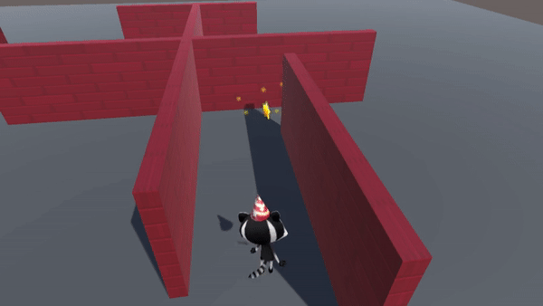
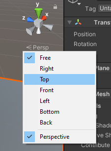
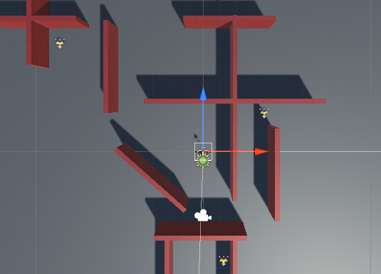

## स्टार इकट्ठा करना

आपके द्वारा इसे एकत्रित करने पर तारे को गायब होने की आवश्यकता होती है। 

{:width="300px"}

एकता में, **triger** के साथ एक कॉलडर `ऑनtrgerEnter` को कॉल करता है जब एक टक्कर होती है, लेकिन यह एक खिलाड़ी को कोलाइडर में चलने से नहीं रोकता है।

--- task ---

**Star** चुनें और निरीक्षक विंडो में, **Add component** पर क्लिक करें। जब तक आप **Box Callder** न देख लें तब तक `bank` लिखना शुरू करें और इसे क्लिक करें। एक नया घटक इंस्पेक्टर विंडो में स्टार में जोड़ा जाएगा।

**is triger** बॉक्स को चेक करें।

दृश्य में स्टार पर ध्यान केंद्रित करने के लिए <kbd>Shift</kbd>+<kbd>F</kbd> पर क्लिक करें। आपको स्टार के चारों ओर एक हरे बॉक्स की रूपरेखा दिखाई देगी: यह कोलाइडर की रूपरेखा को दर्शाता है। यदि खिलाड़ी का कोलाइडर इस क्षेत्र में प्रवेश करता है, तो टक्कर होगी और `OntraggerEnter` कहा जाएगा:

--- /task ---

आप केवल तभी स्टार को इकट्ठा करना चाहते हैं अगर गेमOUTE जो इससे टकरा गया है वह खिलाड़ी है। GameteObereAIER लेबल करने के लिए एकता **टैग्स** का उपयोग करती है। एकता में खिलाड़ी टैग शामिल है।

--- task ---

ड्रॉप-डाउन मेनू का उपयोग करके अपने **Player** गेमOUTE का चयन करें और अपने टैग को `Player` पर सेट करें:

--- /task ---

--- task ---

अपने कोड संपादक पर स्विच करके या प्रोजेक्ट विंडो से अपने **मेरी स्क्रिप्ट्स** फ़ोल्डर में स्क्रिप्ट पर डबल-क्लिक करके अपने स्टार्टकंट्रोलर स्क्रिप्ट खोलें।

`अपडेट` पद्धति के `}` बंद करने के तहत एक नया `ऑनtrygerenter` पद्धति जोड़ें लेकिन `starनियंत्रक` श्रेणी के `}` बंद करने से पहले:

--- code ---
---
language: cs filename: StarController.cs - OnTriggerEnter(Collider other) line_numbers: true line_number_start: 16
line_highlights: 20-27
---

    void Update()
    {
        transform.Rotate(Vector3.up * spinSpeed); // Rotate about the y (up) axis
    }
    void OnTriggerEnter(Collider other)
    {
        // Check the tag of the colliding object
        if (other.CompareTag("Player"))
        {
            gameObject.SetActive(false);
        }
    }
}    
--- /code ---

अपनी स्क्रिप्ट सहेजें।

--- /task ---

--- task ---

**परीक्षण:** अपने प्रोजेक्ट को चलाएं। इसे गायब देखने के लिए तारे में चलें।

**deबग:** सुनिश्चित करें कि आपने खिलाड़ी टैग को अपने खिलाड़ी गेमOUTE में जोड़ा है और स्टार में नहीं!

--- /task ---

एक ध्वनि प्रभाव जोड़ने से एक स्टार को खिलाड़ी के लिए और अधिक संतोषजनक इकट्ठा करने में मदद मिलती है।

--- task ---

Add a `public collectSound` variable to your `StarController` script to store the sound that you want to play:

--- code ---
---
language: cs filename: StarController.cs line_numbers: true line_number_start: 5
line_highlights: 8
---
पब्लिक क्लास स्टारकंट्रोलर : monoBehveor
{ flat spined = .5f; public AyoClip collectsound;

--- /code ---

**Tip:** Making a variable `public` means you can assign it in the Inspector and access it from other GameObjects.

--- /task ---

--- task ---

सितारे के स्थान पर आवाज़ चलाने के लिए `ऑनtrygerEnter` पद्धति में एक पंक्ति जोड़ें। `AyoSource.playClipphtitude` पद्धति ध्वनि चलाएगी:

--- code ---
---
language: cCS फ़ाइलनाम: StarController.cs - OntrygerEnter(Collder other) line_number: True line_number_start: 21
line_highlights: 26
---

    void OnTriggerEnter(Collider other)
    {
        // Check the tag of the colliding object
        if (other.CompareTag("Player"))
        {
            AudioSource.PlayClipAtPoint(collectSound, transform.position);
            gameObject.SetActive(false);
        }
--- /code ---

अपना कोड सहेजें(Save करे)।

--- /task ---

--- task ---

एकता संपादक पर वापस जाएँ और पदानुक्रम विंडो में **Star gamoint** पर क्लिक करें।

निरीक्षक विंडो में सितारा कंट्रोलर स्क्रिप्ट घटक के **collet sound** गुण को खोजें।

ध्वनि एकत्रित करें गुण के दाईं ओर वृत्त पर क्लिक करें और **collate** ध्वनि चुनें:

--- /task ---

--- task ---

**परीक्षण:** अपना दृश्य चलाएं और आवाज़ सुनने के लिए स्टार इकट्ठा करें।

**Debug:** If you get an error that says `The variable collectSound of StarController has not been assigned.` this means you have not set the audio clip in the Inspector:
* Make sure the `collectSound` variable is `public`
* Find the `StarCollector` component in the Inspector of your Star, click the circle and select the `Collect` sound clip from the pop up window. --- /task ---

आपके गेम को और सितारों की आवश्यकता है।

--- task ---

दृश्य दृश्य में अपने स्टार का चयन करें और इसे <kbd>Ctrl</kbd>+<kbd>D</kbd> (या <kbd>Cmd</kbd>+<kbd>D</kbd>) से डुप्लिकेट करें। कण प्रणाली एक चाइल्ड ऑब्जेक्ट है इसलिए इसे आपके नए तारे में दोहराया जाएगा:

नया तारा एक ही स्थिति में दिखाई देगा, इसलिए इसे दृश्य में एक नई छिपने की स्थिति में खींचें। बाल कण प्रणाली तारे के साथ घूमेगी।

अपने नक्शे को एक ऊपरी-नीचे दृश्य में देखने के लिए, उस स्थान पर राइट-क्लिक करें जहाँ यह दृश्य के ऊपरी दाईं ओर **Pperp** कहता है और **top** चुनें। सामान्य दृश्य पर वापस जाने के लिए, **top** पर राइट-क्लिक करें और **Free** चुनें:

आप तीर कुंजियों का उपयोग बाएँ और दाएँ ले जाने और ज़ूम करने के लिए कर सकते हैं। दाएँ माउस बटन को नीचे दबाए रखें और ले जाने और घुमाने के लिए खींचें।

इसे दोहराएं ताकि आपके नक्शे पर तीन सितारे छिपे हों:

--- /task ---

--- task ---

**Test:** Play your scene and collect all the stars. Make sure they all disappear and play a sound when collected.

--- /task ---

--- save ---
