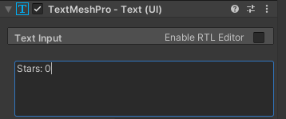
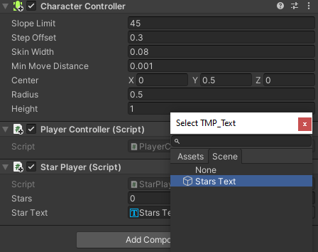

## सितारों की गिनती

खेल अक्सर स्कोर जैसी स्थिति जानकारी दिखाते हैं। आप अब तक एकत्रित सितारों की संख्या दिखाएंगे।

{:width="300px"}

एक एकता गेमOUTE के पास कई स्क्रिप्ट हो सकती हैं। आप खिलाड़ी के पास सितारों की संख्या को संग्रहीत और प्रदर्शित करने के लिए एक नई स्क्रिप्ट जोड़ेंगे।

खिलाड़ी को यह ट्रैक रखने की आवश्यकता है कि उन्होंने कितने सितारों को इकट्ठा किया है, आप एक वेरिएबल के साथ ऐसा कर सकते हैं।

--- task ---

**Player** का चयन करें और निरीक्षक में **Add component** पर क्लिक करें और `starPlayer` नामक एक नई स्क्रिप्ट बनाएं। कोड संपादक में अपनी नई स्क्रिप्ट खोलें और `stars` नामक एक नया वेरिएबल बनाएं:

--- code ---
---
language: cs filename: StarPlayer.cs line_numbers: true line_number_start: 5
line_highlights: 7
---
public class StarPlayer : MonoBehaviour
{ public int stars = 0; // An integer whole number // Start is called before the first frame update void Start()
    { --- /code ---

अपनी स्क्रिप्ट सहेजें और एकता संपादक पर लौटें।

--- /task ---

`starrocontrol` स्क्रिप्ट को स्टार के प्रत्येक बार इकट्ठा होने पर खिलाड़ी पर `stars` वेरिएबल को अपडेट करने की आवश्यकता है।

--- task ---

अपने `starcontrol` स्क्रिप्ट खोलें और स्टार 1 के एकत्रित होने पर खिलाड़ी के पास सितारों की संख्या बढ़ाने के लिए कोड जोड़ें।

`OntriangerEnter` पद्धति के `other` पैरामीटर को गेमOUTE पर सेट किया गया है जो स्टार से टकरा गया है। आप इसका उपयोग `stars` वेरिएबल से `starPlayer` तक पहुंचने के लिए कर सकते हैं:

--- code ---
---
language: cs filename: StarController.cs - OnTriggerEnter(Collider other) line_numbers: true line_number_start: 21
line_highlights: 26, 27
---

    void OnTriggerEnter(Collider other)
    {
        // Check the tag of the colliding object
        if (other.CompareTag("Player"))
        {
            StarPlayer player = other.gameObject.GetComponent<StarPlayer>();
            player.stars += 1; // Increase by 1
            AudioSource.PlayClipAtPoint(collectSound, transform.position);
            gameObject.SetActive(false);
        }
    }
--- /code ---

अपनी स्क्रिप्ट सहेजें और एकता संपादक पर लौटें।

--- /task ---

--- task ---

**परीक्षण:** अपना दृश्य चलाएं और तीन सितारों को इकट्ठा करें। खिलाड़ी के निरीक्षक विंडो में सार्वजनिक `stars` वेरिएबल को देखें ताकि यह पता लगाया जा सके कि आपके द्वारा हर बार एक स्टार एकत्र करने पर संख्या 1 बढ़ जाती है:

**deबग:** यदि आपको निरीक्षक में `stars` वेरिएबल दिखाई नहीं देते हैं, तो सुनिश्चित करें कि आपने अपने `starPlayer.cs` स्क्रिप्ट को सहेजा है।

--- /task ---

यह देखने में सक्षम होना कि आपके परीक्षण के लिए कितने सितारे एकत्र किए गए हैं, यह शानदार है लेकिन उपयोगकर्ता इसे देख नहीं पाएंगे।

 > <strong UI या उपयोगकर्ता इंटरफ़ेस तत्व एक एकता परियोजना को टेक्स्ट, बटन, या स्लिडर्स सहित वस्तुओं का उपयोग करने की अनुमति देते हैं ताकि उपयोगकर्ता या खिलाड़ी के साथ बातचीत और बातचीत की जा सके। UI तत्वों का उपयोग अक्सर गेम स्टार्ट स्क्रीन और सेटिंग के लिए और उपयोगकर्ता को जानकारी देने और उपयोगकर्ता को विकल्प बनाने की अनुमति देने के लिए किया जाता है। 

--- task ---

पदानुक्रम विंडो में राइट-क्लिक करें और **UI** पर जाएं, फिर **टेक्स्ट - टेक्स्ट मेश्प्रो** चुनें। यह एक चाइल्ड टेक्स्ट ऑब्जेक्ट के साथ एक कैनवास बनाता है; आप **गेम दृश्य** में टेक्स्ट देख सकते हैं:

--- collapse ---

---
title: First time using TextMeshPro pop-up
---

आपको एक पॉप-अप विंडो दिखाई दे सकती है, जो आपसे टेक्स्ट मेशप्रो आवश्यकताएं, उदाहरण और एक्सट्रा को अपने प्रोजेक्ट में आयात करने के लिए कहती है। यदि ऐसा है, तो दो **आयात** बटन पर क्लिक करें, फिर विंडो बंद करें:

--- /collapse ---

--- /task ---

--- task ---

नए **text - (TMP) gamob** पर राइट-क्लिक करें और `name` चुनें। इसे आसानी से पहचानने के लिए इसे `stars text` कहें:

--- /task ---

--- task ---

निरीक्षक विंडो में, टेक्स्ट मेशप्रो गेमObert के लिए, **इनपुट टेक्स्ट** घटक पर जाएं। `नया टेक्स्ट` को `starts: 0` में बदलें:

--- /task ---

--- task ---

**Rect transform** घटक में, संरेखण को **top left** पर क्लिक करें और बदलें। और स्थिति को `x = 120`, `y = -50` में बदलें।

यह आपके पाठ के केंद्र को बाएँ से 120 पिक्सेल और शीर्ष से -50 पिक्सेल में स्थित करेगा। यदि आप गेम दृश्य का आकार बदलते हैं, तो टेक्स्ट सही स्थिति में रहेगा:

**युक्ति:** आप गेम दृश्य में टेक्स्ट की स्थिति देख सकते हैं, भले ही आप प्ले मोड में न हों।

--- /task ---

अब आपको प्रदर्शित होने वाले टेक्स्ट को अपडेट करने की आवश्यकता है ताकि यह खिलाड़ी द्वारा एकत्रित सितारों की वर्तमान संख्या को दिखाए।

--- task ---

अपनी `starPlayer` स्क्रिप्ट खोलें और शीर्ष पर `taming TMPro` जोड़ें ताकि आपकी स्क्रिप्ट `tMP_text` का उपयोग कर सके:

--- code ---
---
language: cs filename: StarPlayer.cs line_numbers: true line_number_start: 1
line_highlights: 4
---
using System.Collections; using System.Collections.Generic; using UnityEngine; using TMPro; --- /code ---

--- /task ---

--- task ---

TMP_text ऑब्जेक्ट बनाने के लिए कोड जोड़ें जिसे `storText` कहा जाता है:

--- code ---
---
language: python filename: StarPlayer.cs line_numbers: true line_number_start: 6
line_highlights: 9
---
public class StarPlayer : MonoBehaviour
{ public int stars = 0; // An integer whole number public TMP_Text starText; // Start is called before the first frame update --- /code ---

--- /task ---

--- task ---

`setText` विधि का उपयोग `TMP_text` क्लास से करें ताकि प्रत्येक अपडेट पर एकत्रित सितारों की संख्या प्रदर्शित की जा सके:

--- code ---
---
language: python filename: StarPlayer.cs - Update() line_numbers: true line_number_start: 16
line_highlights: 21
---
public class StarPlayer : MonoBehaviour
{
    // Update is called once per frame
    void Update()
    {
        starText.SetText("Stars: " + stars);
    }
--- /code ---

अपना कोड सेव करें और एकता संपादक पर वापस स्विच करें।

--- /task ---

--- task ---

`starPlayer` स्क्रिप्ट के लिए खिलाड़ी की निरीक्षक विंडो में, स्टार टेक्स्ट गुण के आगे के वृत्त पर क्लिक करें और अपने टेक्स्ट ऑब्जेक्ट को लिंक करने के लिए **stars text** चुनें।

--- /task ---

--- task ---

Play your scene and check that the number in the UI text increases each time you collect a star:

--- /task ---

--- save ---

