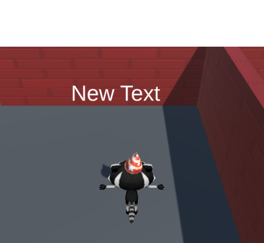

## समय रखना

अब जब एक खिलाड़ी सितारों को इकट्ठा कर सकता है, सभी तीन सितारों को इकट्ठा करने में लगने वाले समय की मात्रा को दिखाने के लिए एक टाइमर जोड़ सकता है। 

{:width="300px"}

 Accountry mechanics गेम डिजाइन का एक प्रमुख हिस्सा हैं। वे नियम हैं जो एक खिलाड़ी के कार्यों को नियंत्रित करते हैं। एक#टाइमर** एक गेम मैकेनिक है जो वीडियो गेम में एक चुनौती जोड़ता है - वास्तव में, इस आधार पर कई गिनीज वर्ल्ड रिकॉर्ड हैं कि खिलाड़ी कितनी जल्दी खेल में चुनौतियों को पूरा कर सकते हैं!

खिलाड़ी को यह ट्रैक रखने की आवश्यकता है कि वह कितने समय तक मिनीगेम को पूरा करने में ले रहा है, आप इसे एक और वेरिएबल के साथ कर सकते हैं।

--- task ---

पदानुक्रम विंडो में, अपने **कैनवास** पर राइट-क्लिक करें और UI से एक और **टेक्स्ट - टेक्स्ट मेशप्रो गेमOUse** बनाएं। आपको गेम व्यू में अपनी स्क्रीन पर लिखा हुआ 'नया टेक्स्ट' दिखाई देगा:

--- /task ---

--- task ---

नए **text (TMP) गेमOUTE** पर राइट-क्लिक करें और **name** चुनें। इसे आसानी से पहचानने के लिए इसे `time text` पर कॉल करें:

--- /task ---

--- task ---

निरीक्षक विंडो से, नए टेक्स्ट मेशप्रो गेमOUTE के लिए टेक्स्ट इनपुट प्रोफिट में, `नया टेक्स्ट` को `time: 0` में बदलें।

**Rect transform** घटक का उपयोग करें ताकि संरेखण को **top** में बदला जा सके। साथ ही स्थिति को `x = -60`, `y = -50` में बदलें:

--- /task ---

प्रदर्शित टेक्स्ट को अपडेट करने की आवश्यकता है ताकि खेल शुरू होने के बाद से यह लगातार सेकंड की संख्या दिखाता रहे।

--- task ---

अपना `starPlayer` स्क्रिप्ट खोलें और `timeText` नामक TMP_text ऑब्जेक्ट बनाने के लिए कोड जोड़ें:

--- code ---
---
language: cs filename: StarPlayer.cs line_numbers: true line_number_start: 6
line_highlights: 10
---
public class StarPlayer : MonoBehaviour
{ public int stars = 0; // An integer whole number public TMP_Text starText; public TMP_Text timeText; --- /code ---

--- /task ---

--- task ---

`time.time` दृश्य शुरू होने के बाद से समय को सेकंड में देता है। `mathf.round` एक संख्या को पूर्णांक में बदल देता है।

प्रत्येक अपडेट पर पूरे सेकंड की संख्या दिखाने के लिए टेक्स्ट सेट करें:

--- code ---
---
language: cs filename: StarPlayer.cs - Update() line_numbers: true line_number_start: 18
line_highlights: 21
---

    void Update()
    {
        starText.SetText("Stars: " + stars);
        timeText.SetText("Time: " + Mathf.Round(Time.time));
    }
--- /code ---

अपनी स्क्रिप्ट सहेजें और एकता संपादक पर वापस जाएँ।

--- /task ---

--- task ---

पदानुक्रम विंडो में खिलाड़ी का चयन करें और निरीक्षक विंडो में `Star Player` स्क्रिप्ट घटक पर जाएं। `time text` के आगे के वृत्त पर क्लिक करें और अपना नया 'time text' ऑब्जेक्ट चुनें।

--- /task ---

--- task ---

**परीक्षण:** अपना मिनिएग्म चलाएं और जांचें कि आपके खेलने पर समय अपडेट होता है। क्या होता है जब आप सभी तीन सितारों को इकट्ठा करते हैं?

--- /task ---

समय को रोकने की आवश्यकता है जब सभी तीन सितारों को इकट्ठा किया जाता है, लेकिन वर्तमान में जब तक मिनीगेम चल रहा है तब तक यह गिनती जारी रखेगा।

--- task ---

`starPlayer` स्क्रिप्ट खोलें और अपने समय कोड के चारों ओर एक if स्टेटमेंट बनाएं ताकि केवल उन सेकंड को गिना जा सके यदि खिलाड़ी ने तीन सितारों से कम को इकट्ठा किया है:

--- code ---
---
language: python filename: StarPlayer.cs - Update() line_numbers: true line_number_start: 18
line_highlights: 21-24
---

    void Update()
    {
        starText.SetText("Stars: " + stars);
        if (stars < 3)
        {
            timeText.SetText("Time: " + Mathf.Round(Time.time));
        }
    }
--- /code ---

अपनी स्क्रिप्ट सहेजें और एकता संपादक पर वापस जाएँ।

--- /task ---

--- task ---

**परीक्षण:** फिर से अपनी मिनीगेम चलाएं। खिलाड़ी के तीन सितारे होने पर टाइमर रुक जाएगा:

--- /task ---

प्रतिबिम्ब चरण के बाद, आप अपने प्रोजेक्ट को उन सुविधाओं के साथ अपग्रेड कर सकते हैं जिन्हें आप महत्वपूर्ण समझते हैं।

--- save ---
