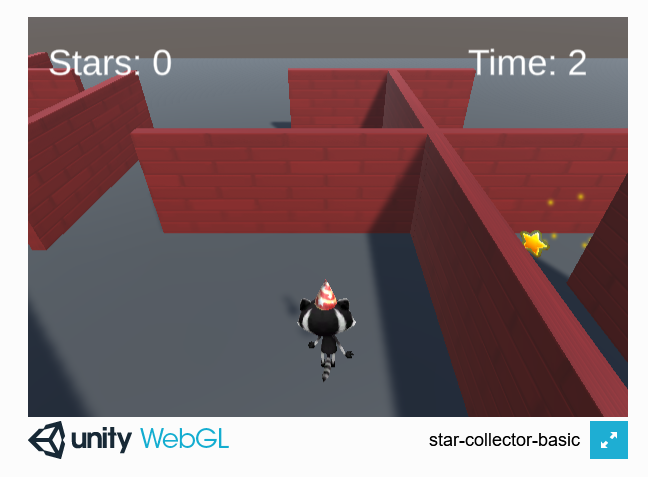

## You will make

Maak een minigame waar je zo snel mogelijk ronddraaiende sterren verzamelt.

Dit project wordt je aangeboden met de genereuze steun van [Unity Technologies](https://unity.com/){:target="_blank"}.  Deze [projecten](https://projects.raspberrypi.org/en/pathways/unity-intro){:target="_blank"} bieden jongeren de kans om hun eerste stappen te zetten in het maken van virtuele werelden met behulp van Real-Time 3D.

Dit project volgt op [Verken een 3D wereld](https://projects.raspberrypi.org/en/projects/explore-a-3d-world){:target="_blank"}. Je kunt de Unity-scene die je in dat project hebt gemaakt gebruiken als basis voor dit project. We hebben ook een startersproject voorzien dat je kunt gebruiken.

Een **minigame** is een kort computerspel. Grotere computergames bevatten vaak meerdere minigames. Speel jij spellen die minigames bevatten?

Je zal:

+ **Colliders** en **triggers** gebruiken om te bepalen wat er gebeurt wanneer GameObjecten botsen
+ **Geluid** en **particle effects** toevoegen
+ Score en tijd **variabelen** maken, instellen en weergeven

--- no-print ---

### Play ▶️

--- task ---

Click on the embedded project. Try and collect the stars as fast as you can. How close do you have to be to a star to collect it? What happens to the time when you have collected all of the stars? What graphic effects do the stars have?
<iframe allowtransparency="true" width="710" height="450" src="https://star-collector-basic.rpfilt.repl.co" frameborder="0"></iframe>

--- /task --- --- /no-print ---

--- print-only ---

--- /print-only ---
