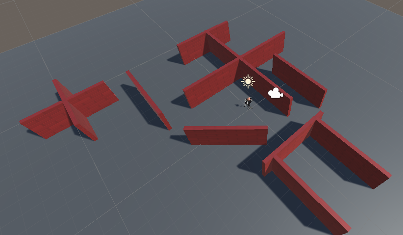
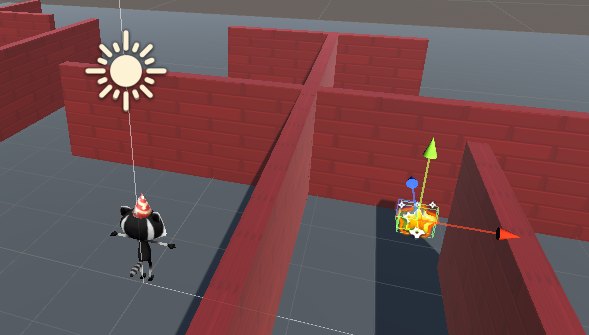

## A spinning star

The collectibles in this game are stars that spin to attract attention.

{:width="300px"}

--- task ---

Launch the Unity Hub and open the project you created for [Explore a 3D world](https://projects.raspberrypi.org/en/projects/explore-a-3d-world){:target=blank}.

--- collapse ---
---
title: Ik heb mijn Verken een 3D wereld project niet
---

Als je het project 'Verken een 3D wereld' niet kunt openen, kun je dit [Sterrenverzamelaar start pakket](https://rpf.io/p/en/star-collector-go){:target=blank} downloaden, uitpakken en importeren.

Nadat het pakket is geïmporteerd, ga je naar de Assets map en dubbelklik je op de **3D World** scene om deze te laden.

--- /collapse ---

[[[unity-importing-a-package]]]

--- /task ---

--- task ---

Klik met de rechtermuisknop op de **3D World** scène in het hiërarchie venster en **Scène opslaan als** `Sterrenverzamelaar`.

Hiermee wordt een nieuw scènebestand gemaakt in het Project venster. Scènes in een project kunnen Assets, inclusief scripts, delen.

Je project bevat nu twee scènes, maar je zult slechts op één scène tegelijk werken.

--- /task ---

--- task ---

De sterrenverzamelaar minigame heeft een camerabeeld nodig dat hoog genoeg is om de lay-out van een deel van de kaart te bekijken, maar niet te hoog, anders wordt de positie van de sterren onthuld.

Klik in het Hierarchy venster op **speler** en selecteer vervolgens **Main Camera**, en wijzig de positie en rotatie in de Transform-component van het Inspector-venster in:

--- /task ---

--- task ---

Je zult ook nog een paar muren aan je scène moeten toevoegen. Klik op een muur en druk op <kbd>Ctrl</kbd>+<kbd>D</kbd> om de muur te dupliceren.

Positioneer de nieuwe muren met behulp van de gereedschappen transformeren en roteren of door de waarden in de Transform-component te wijzigen. Herhaal dit meerdere keren, zodat je genoeg plekken hebt om de sterren te verbergen.

Je kunt door je scène navigeren om deze vanuit verschillende hoeken te bekijken. Als je verdwaald raakt, klik je op je speler in de hiërarchie en gebruik je <kbd>Shift</kbd>+<kbd>F</kbd> om je te focussen op de speler.

[[[unity-transform-tools]]]

[[[unity-scene-navigation]]]

--- /task ---

--- task ---

Ga in het Project venster naar de map **Models** en sleep de **Ster** naar de **Scèneweergave**.

--- /task ---

--- task ---

Zorg ervoor dat het Ster GameObject is geselecteerd in het Hierarchy venster en positioneer het met behulp van:
+ De pijlen van het gereedschap transformatie en de scèneweergave
+ De coördinaten van de Transform component in het Inspector venster

Je ster moet los van de grond zijn; positie `y = 0.7` is ongeveer goed.

Je zou de ster achter een muur kunnen verbergen zodat het moeilijker is voor de spelers van je spel om ze te vinden:

--- /task ---

--- task ---

Klik in het Inspector venster op **Add Component** en kies **New script**, en geef het nieuwe script vervolgens de naam `SterController`.

Dubbelklik op `SterController` in de script component om je script in de editor te openen.

--- /task ---

In [Explore a 3D world](https://projects.raspberrypi.org/en/projects/explore-a-3d-world/){:target="_blank"} you used `transform.Rotate` to turn the Player. Je kunt dezelfde methode gebruiken om de Ster rond de y-as te draaien.

--- task ---

Maak onder public class code een variabele met de naam `draaiSnelheid`, zodat je kunt bepalen hoe snel je ster draait:

--- code ---
---
language: cs filename: SterController.cs line_numbers: True line_number_start: 5
line_highlights: 7
---
public class StarController : MonoBehaviour
{ float spinSpeed = 0.5f;

--- /code ---

Voeg code toe om je ster te laten draaien:

--- code ---
---
language: cs filename: SterController.cs - Update() line_numbers: True line_number_start: 16
line_highlights: 18
---

    void Update()
    {
        transform.Rotate(Vector3.up * spinSpeed); // Rotate about the y (up) axis
    }
--- /code ---

Sla je script op en ga terug naar de Unity Editor.

--- /task ---

--- task ---

**Test:** Speel je scène en controleer of de ster draait:

**Debug:** Make sure you added the Script to the Star GameObject. Als je het per ongeluk aan een ander GameObject hebt toegevoegd, kun je op de drie puntjes naast het script-onderdeel klikken en **Remove component** kiezen.

**Debug:** Change the value of your `spinSpeed` variable if you want to speed up or slow down the speed at which the star spins.

--- /task ---

Tijd voor een Particle System.

Een **particle effect** gebruikt veel kleine afbeeldingen, of 'particles', om een visueel effect te creëren dat een computerspel tot leven brengt. Let de volgende keer dat je een computerspel speelt op alle plaatsen waar deeltjeseffecten worden gebruikt. 

--- task ---

Right-click on the **Star GameObject** in the Hierarchy window and choose **Effects** then **Particle System**. Hiermee wordt een Particle System GameObject aan de Ster toegevoegd.

Adding the Particle System as a child object of the Star means that if you move the star in Scene view, the particles will move with it.

--- /task ---

--- task ---

**Test:** Speel je scène om het standaard deeltjeseffect te zien. Het draait met de ster en het is niet helemaal goed voor een fonkelende ster:

Sluit de afspeelmodus af.

--- /task ---

Er zijn veel instellingen die je kunt gebruiken om het Particle System aan te passen.

--- task ---

Klik op **Particle System** onder de ster in de Hierarchy. Gebruik deze instellingen om een fonkelend effect te creëren dat niet meedraait met de ster:

**Tip:** om de kleurkiezer te sluiten, klik op de 'X' of klik ergens anders in de Unity Editor.

--- /task ---

--- task ---

**Test:** Klik op **afspelen** om het effect te zien.

Pas de instellingen aan totdat je tevreden bent met het deeltjeseffect.

Onthoud dat je dingen kunt uitproberen in de afspeelmodus, maar dat je de afspeelmodus moet verlaten om wijzigingen aan te brengen die je wilt behouden:

--- /task ---

Nu vraagt die ster gewoon om verzameld te worden!

--- save ---
