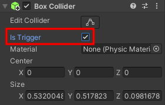

## De ster verzamelen

De ster moet verdwijnen wanneer je hem verzamelt. 

{:width="300px"}

In Unity roept een Collider met een **Trigger** de `OnTriggerEnter` methode op wanneer er een botsing plaatsvindt, maar het verhindert niet dat een speler door de Collider loopt.

--- task ---

Selecteer de **Ster** en klik in het Inspector venster op **Add Component**. Begin met het typen van `box` totdat je **Box Collider** ziet en klik erop. Er wordt een nieuwe component toegevoegd aan de Ster in het Inspector venster.

Vink het selectievakje **is Trigger** aan.

Klik <kbd>Shift</kbd>+<kbd>F</kbd> om in te zoomen op de Ster in de scèneweergave. Je ziet een groene kader rond de Ster: dit toont de omtrek van de Collider. Als de Collider van de speler dit gebied betreedt, is er een botsing en wordt `OnTriggerEnter` aangeroepen:

--- /task ---

Je wilt dat de ster alleen verzameld wordt als het GameObject dat ermee in botsing is gekomen de speler is. Unity gebruikt **Tags** om GameObjects te labelen. Unity bevat een spelertag.

--- task ---

Selecteer je **speler** GameObject en stel de tag in op `Player` met behulp van het vervolgkeuzemenu:

--- /task ---

--- task ---

Open het SterController-script door over te schakelen naar je code-editor of door te dubbelklikken op het script in de map **My Scripts** in het Project-venster.

Voeg een nieuwe `OnTriggerEnter` methode toe onder het sluiten van `}` van de `Update` methode, maar voor het sluiten van `}` van de `StarController` klasse:

--- code ---
---
language: cs filename: StarController.cs - OnTriggerEnter(Collider other) line_numbers: true line_number_start: 16
line_highlights: 20-27
---

    void Update()
    {
        transform.Rotate(Vector3.up * spinSpeed); // Rotate about the y (up) axis
    }
    void OnTriggerEnter(Collider other)
    {
        // Check the tag of the colliding object
        if (other.CompareTag("Player"))
        {
            gameObject.SetActive(false);
        }
    }
} --- /code ---

Sla je script op.

--- /task ---

--- task ---

**Test:** Speel je project. Loop tegen de ster om hem te zien verdwijnen.

**foutopsporing:** Zorg ervoor dat je de spelertag aan je Spelersobject hebt toegevoegd en niet aan de Ster!

--- /task ---

Het toevoegen van een geluidseffect maakt het verzamelen van een ster leuker voor de speler.

--- task ---

Voeg een publieke variabele `collectSound` toe aan je `StarController` script om het geluid op te slaan dat je wilt afspelen:

--- code ---
---
language: cs filename: StarController.cs line_numbers: true line_number_start: 5
line_highlights: 8
---
public class StarController : MonoBehaviour
{ float spinSpeed = 0.5f; public AudioClip collectSound;

--- /code ---

Het `public` maken van een variabele betekent dat je deze kunt toewijzen in de Inspector en dat je hier toegang toe hebt vanuit andere GameObjects.

--- /task ---

--- task ---

Voeg een regel toe aan de `OnTriggerEnter` methode om het geluid op de locatie van de ster af te spelen. De `AudioSource.PlayClipAtPoint` methode speelt het geluid af:

--- code ---
---
language: cs filename: SterController.cs - OnTriggerEnter(Collider other) line_numbers: true line_number_start: 21
line_highlights: 26
---

    void OnTriggerEnter(Collider other)
    {
        // Check the tag of the colliding object
        if (other.CompareTag("Player"))
        {
            AudioSource.PlayClipAtPoint(collectSound, transform.position);
            gameObject.SetActive(false);
        }
--- /code ---

Sla je code op.

--- /task ---

--- task ---

Schakel terug naar de Unity Editor en klik op het **Ster GameObject** in het Hierarchy venster.

Zoek de eigenschap **verzamelGeluid** van het SterController script component van de Ster in het Inspector venster.

Klik op de cirkel rechts van de eigenschap verzamelGeluid en kies het **Collect** geluid:

--- /task ---

--- task ---

**Test:** Speel je scène en verzamel de ster om het geluid te horen.

**Debug:** If you get an error that says `The variable collectSound of StarController has not been assigned.` this means you have not set the audio clip in the Inspector:
* Make sure the `collectSound` variable is `public`
* Find the `StarCollector` component in the Inspector of your Star, click the circle and select the `Collect` sound clip from the pop up window. --- /task ---

Je spel heeft meer sterren nodig.

--- task ---

Selecteer je Ster in de scèneweergave en kopieer deze met <kbd>Ctrl</kbd>+<kbd>D</kbd> (of <kbd>Cmd</kbd>+<kbd>D</kbd>). Het Particle System is een onderliggend object, dus dit wordt gedupliceerd in je nieuwe ster:

De nieuwe ster verschijnt op dezelfde positie, dus sleep hem naar een nieuwe positie in de scène. Het onderliggende Particle System beweegt mee met de ster.

Als je de kaart in een bovenaanzicht wilt zien, klik je met de rechtermuisknop waar **Persp** staat in de rechterbovenhoek van de scèneweergave en kies je **Top**. Om terug te keren naar de normale weergave, klik met de rechtermuisknop op **Top** en kies **Free**:

Je kunt de pijltjestoetsen gebruiken om naar links en rechts te gaan en in te zoomen. Houd de rechtermuisknop ingedrukt en sleep om te bewegen en te draaien.

Herhaal dit totdat je drie sterren op je kaart hebt verborgen:

--- /task ---

--- task ---

**Test:** Speel je scène en verzamel alle sterren. Zorg ervoor dat ze allemaal verdwijnen en dat een geluid wordt afgespeeld wanneer ze worden verzameld.

--- /task ---

--- save ---
