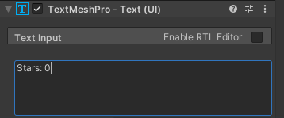

## Sterren tellen

Spellen tonen vaak statusinformatie zoals een score. Je zal het aantal sterren tonen dat tot nu toe werd verzameld.

{:width="300px"}

Een Unity GameObject kan meerdere scripts hebben. Je voegt een nieuw script toe aan de speler om het aantal sterren dat ze hebben op te slaan en weer te geven.

De speler moet bijhouden hoeveel sterren ze hebben verzameld, je kunt dit doen met een variabele.

--- task ---

Selecteer de **speler** en klik in de Inspector op **Add Component** en maak een nieuw script met de naam `StarPlayer`. Open je nieuwe script in de code-editor en maak een nieuwe variabele met de naam `stars`:

--- code ---
---
language: cs
filename: StarPlayer.cs
line_numbers: true
line_number_start: 5
line_highlights: 7
---
public class StarPlayer : MonoBehaviour
{
    public int stars = 0; // Een geheel getal
    // Start is called before the first frame update
    void Start()
    {
--- /code ---

Sla je script op en ga terug naar de Unity Editor.

--- /task ---

Het `StarController` script moet de `stars` variabele van de speler bijwerken telkens wanneer er een ster wordt verzameld.

--- task ---

Open je `StarController` script en voeg code toe om het aantal sterren dat de speler heeft met 1 te verhogen telkens wanneer een ster wordt verzameld.

De `other` parameter van de `OnTriggerEnter` methode is ingesteld op het GameObject dat in botsing is gekomen met de Ster. Je kunt het gebruiken om toegang te krijgen tot de `stars` variabele uit `StarPlayer`:

--- code ---
---
language: cs
filename: StarController.cs - OnTriggerEnter(Collider other)
line_numbers: true
line_number_start: 21
line_highlights: 26, 27
---
    void OnTriggerEnter(Collider other)
    {
        // Controleer de tag van het botsende object
        if (other.CompareTag("Player"))
        {
            StarPlayer player = other.gameObject.GetComponent<StarPlayer>();
            player.stars += 1; // Verhoog met 1
            AudioSource.PlayClipAtPoint(collectSound, transform.position);
            gameObject.SetActive(false);
        }
    }
--- /code ---

Sla je script op en ga terug naar de Unity Editor.

--- /task ---

--- task ---

**Test:** Speel je scène en verzamel de drie sterren. Bekijk de public variabele `stars` in het speler Inspector venster om te controleren of het aantal met 1 toeneemt telkens wanneer je een ster verzamelt:

**Debug:** als je de `stars` variabele niet ziet in de Inspector, zorg er dan voor dat je het `StarPlayer.cs` script hebt opgeslagen.

--- /task ---

Het is geweldig om tijdens je tests te zien hoeveel sterren er zijn verzameld, maar gebruikers zullen dat niet kunnen zien.

**UI** of User Interface-elementen stellen een Unity-project in staat om objecten zoals tekst, knoppen of schuifregelaars te gebruiken om met de gebruiker of speler te communiceren. UI-elementen worden vaak gebruikt voor beginschermen van het spel of instellingen en voor het geven van informatie aan de gebruiker en om de gebruiker keuzes te laten maken. 

--- task ---

Klik met de rechtermuisknop in het Hierarchy venster en ga naar **UI** en selecteer vervolgens **Text - TextMeshPro**. Hiermee wordt een canvas gemaakt met een onderliggend tekstobject; je kunt de tekst zien in de **Game view**:

--- collapse ---

---
title: De eerste keer een TextMeshPro bericht gebruiken
---

Je ziet misschien een pop-upvenster waarin je wordt gevraagd om TextMeshPro essentials, voorbeelden en extra's in je project te importeren. Als dit het geval is, klik dan achtereenvolgens op de twee **Import** knoppen en sluit vervolgens het venster:

--- /collapse ---

--- /task ---

--- task ---

Klik met de rechtermuisknop op het nieuwe **Text - (TMP) GameObject** en selecteer `rename`. Noem het `Stars Text` om het gemakkelijk te kunnen herkennen:

--- /task ---

--- task ---

Ga in het Inspector venster van het TextMeshPro GameObject naar de **Text Input** component. Wijzig `New Text` in `Stars: 0`:

--- /task ---

--- task ---

Klik op de **Rect Transform** component en wijzig de uitlijning in **Top Left**. En verander de positie naar `x = 120`, `y = -50`.

Hierdoor wordt het midden van de tekst 120 pixels van linkerkant en -50 pixels van bovenkant geplaatst. De tekst blijft op zijn plaats als je het formaat van de spelweergave wijzigt:

**Tip:** je kunt de positie van de tekst in de spelweergave bekijken, zelfs als je niet in de spelmodus bent.

--- /task ---

Nu moet je de tekst die wordt weergegeven bijwerken, zodat het huidige aantal sterren dat door de speler is verzameld wordt getoond.

--- task ---

Open je `StarPlayer` script en voeg `using TMPro` bovenaan toe zodat je script `TMP_Text` kan gebruiken:

--- code ---
---
language: cs
filename: StarPlayer.cs
line_numbers: true
line_number_start: 1
line_highlights: 4
---
using System.Collections;
using System.Collections.Generic;
using UnityEngine;
using TMPro;
--- /code ---

--- /task ---

--- task ---

Voeg code toe om een TMP_Text object met de naam `starText` te maken:

--- code ---
---
language: cs
filename: StarPlayer.cs
line_numbers: true
line_number_start: 6
line_highlights: 9
---
public class StarPlayer : MonoBehaviour
{
    public int stars = 0; // Een geheel getal
    public TMP_Text starText;
    // Start is called before the first frame update
--- /code ---

--- /task ---

--- task ---

Gebruik de `SetText` methode uit de `TMP_Text` klasse om het aantal sterren weer te geven dat bij elke update is verzameld:

--- code ---
---
language: cs
filename: StarPlayer.cs - Update()
line_numbers: true
line_number_start: 16
line_highlights: 21
---
public class StarPlayer : MonoBehaviour
{
    // Update is called once per frame
    void Update()
    {
        starText.SetText("Stars: " + stars);
    }
--- /code ---

Sla je code op en keer terug naar de Unity Editor.

--- /task ---

--- task ---

Klik in het speler Inspector venster in het `StarPlayer` script op de cirkel naast de eigenschap Stertekst en kies **Stars Text** om je tekstobject te koppelen.

--- /task ---

--- task ---

Speel je scène en controleer of het getal in de UI-tekst toeneemt telkens wanneer je een ster verzamelt:

--- /task ---

--- save ---

